```mermaid
graph LR
    subgraph "Cycle 1: WIRE"
        W1_1["W1 Haiku<br/>read 4 files"]
        W1_2["W2 Opus<br/>decide diffs"]
        W1_3["W3 Sonnet<br/>apply edits"]
        W1_4["W4 Sonnet<br/>verify"]
        W1_1 -->|mark| W1_2 -->|mark| W1_3 -->|mark| W1_4
    end
    subgraph "Cycle 2: PROVE"
        W2_1["W1 Haiku<br/>read ~20 files"]
        W2_2["W2 Opus<br/>decide diffs"]
        W2_3["W3 Sonnet<br/>apply edits"]
        W2_4["W4 Sonnet<br/>verify"]
        W2_1 -->|mark| W2_2 -->|mark| W2_3 -->|mark| W2_4
    end
    subgraph "Cycle 3: GROW"
        W3_1["W1 Haiku<br/>read ~20 files"]
        W3_2["W2 Opus<br/>decide diffs"]
        W3_3["W3 Sonnet<br/>apply edits"]
        W3_4["W4 Sonnet<br/>verify"]
        W3_1 -->|mark| W3_2 -->|mark| W3_3 -->|mark| W3_4
    end
    W1_4 -->|gate| W2_1
    W2_4 -->|gate| W3_1
    style W1_1 fill:#4a9,stroke:#333
    style W2_1 fill:#4a9,stroke:#333
    style W3_1 fill:#4a9,stroke:#333
    style W1_2 fill:#e74,stroke:#333
    style W2_2 fill:#e74,stroke:#333
    style W3_2 fill:#e74,stroke:#333
```

# TODO: Rename Dead Names Across Docs

**Goal:** Propagate [`names.md`](names.md) — the locked naming spec — through every
`docs/*.md` file. Kill 10 dead names. Preserve metaphor aliases. Leave the
doc tree speaking one vocabulary.

**Shape:** Three cycles (Wire → Prove → Grow), each with four waves.
Every wave is one tick of the substrate loop — select → ask → mark/warn → drain.
Cycles are sequential. Waves within cycles are sequential. Parallelism is
*within* each wave.

```
   CYCLE 1: WIRE           CYCLE 2: PROVE          CYCLE 3: GROW
   core canonical docs     high-traffic docs        strategy/agent docs
   ─────────────────       ──────────────────       ─────────────────
   5 files, ~40 edits      ~20 files, ~300 edits    ~20 files, ~200 edits
        │                        │                        │
        ▼                        ▼                        ▼
   ┌─W1─W2─W3─W4─┐        ┌─W1─W2─W3─W4─┐        ┌─W1─W2─W3─W4─┐
   │ H   O  S  S  │  ──►   │ H   O  S  S  │  ──►   │ H   O  S  S  │
   └──────────────┘        └──────────────┘        └──────────────┘

   H = Haiku (recon)    O = Opus (decide)    S = Sonnet (edit + verify)
```



---

## How Loops Drive This Roadmap

Each cycle activates deeper substrate loops:

| Cycle | What changes | Loops activated |
|-------|-------------|-----------------|
| **WIRE** | Core docs speak canonical names. Other docs copy from these. | L1 (signal routing), L2 (path marking) |
| **PROVE** | Tutorials and code docs match. Users read correct vocabulary. | L3 (fade — old names stop appearing), L5 (evolution — stale docs rewritten) |
| **GROW** | Strategy, ontology, agent docs all aligned. Full consistency. | L6 (learning — naming is permanent knowledge), L7 (frontier — no unknown naming gaps) |

The cycle gate is the substrate's `know()` — you don't advance until the
cycle's patterns are verified and promoted to durable learning.

---

## Source of Truth

**[`names.md`](names.md)** — 10 retired names, 10 canonical replacements.

| Dead name | Canonical | Exceptions (DO NOT rename) |
|-----------|-----------|---------------------------|
| `emit` | `send` | Ant row in metaphor tables ("forage") |
| `trail` | `path` | Ant-biology prose ("pheromone trail"), "audit trail" |
| `knowledge` | `learning` | "knowledge base" in non-ONE context |
| `alarm` | `resistance` | Ant row in metaphor tables ("alarm pheromone") |
| `scent` | `strength` | Ant row in metaphor tables |
| `colony` | `community` | Ant metaphor prose, metaphor tables, `ants.md` |
| `node` | `actor` / `unit` | ReactFlow UI node, graph visualization context |
| `system-prompt` | `prompt` | — |
| `connections` | `paths` | "network connections" in non-ONE context |
| `people` | `actors` | Casual prose ("more people use it") |

**Skip entirely:** `migration.md` (intentional history), `names.md` (defines both)

---

## Cycle 1: WIRE — Core Canonical Docs

**Files:** [`dictionary.md`](dictionary.md), [`routing.md`](routing.md),
[`primitives.md`](primitives.md), [`receivers.md`](receivers.md)

**Why first:** Every other doc copies terminology from these four.
Fix the source, the downstream fixes become mechanical.

**Already done:** [`DSL.md`](DSL.md) — all 6 dead names replaced (2026-04-14).

---

### Wave 1 — Recon (parallel Haiku × 4)

Spawn 4 agents. Each reads one file, reports every dead name with line
number, surrounding context, and whether it's a metaphor exception.

**Hard rule:** "Report verbatim. Do not propose changes. Under 300 words."

| Agent | File | Dead names expected |
|-------|------|---------------------|
| R1 | `dictionary.md` | emit(5), trail(14), knowledge(5), alarm(2), system-prompt(3), connections(2), scent(1) |
| R2 | `routing.md` | emit(7), trail(5), alarm(8), scent(3), knowledge(1), node(1), people(1) |
| R3 | `primitives.md` | emit(1+), trail(7), system-prompt(2) |
| R4 | `receivers.md` | colony(3), trail(9) |

**Outcome model:** `result` = report in. `timeout` = re-spawn once.
`dissolved` = file missing, drop. Advance when 4/4 reports are in.

---

### Wave 2 — Decide (Opus, in main context)

Take 4 reports + [`names.md`](names.md). For each dead name in each file, decide:
- **Replace** → produce anchor (exact old text) + new text
- **Keep** → it's a metaphor exception or non-ONE usage
- **Judgment call** → explain reasoning

**Output format (one per edit):**
```
TARGET:    docs/dictionary.md
ANCHOR:    "<exact unique substring>"
ACTION:    replace
NEW:       "<new text>"
RATIONALE: "<one sentence>"
```

**Key decisions for Cycle 1:**
1. `dictionary.md` trail(14) — which are "pheromone trail" metaphor? Which are dead-name "trail"?
2. `routing.md` alarm(8) — which are in metaphor tables (keep) vs prose (replace)?
3. `receivers.md` colony(3) — group-type usage (replace) vs ant-metaphor (keep)?
4. `routing.md` node(1) — is it ReactFlow context or ONE ontology?

---

### Wave 3 — Edits (parallel Sonnet × 4)

One agent per file. Each gets: file path, list of anchors + replacements,
the rule: "Use `Edit` with exact anchor. Do not modify anything else.
If anchor doesn't match, return dissolved."

| Job | File | Est. edits |
|-----|------|-----------|
| E1 | `dictionary.md` | ~25 |
| E2 | `routing.md` | ~20 |
| E3 | `primitives.md` | ~10 |
| E4 | `receivers.md` | ~10 |

---

### Wave 4 — Verify (Sonnet × 1)

Read all 5 core docs (DSL.md + the 4 just edited). Check:
1. No dead names remain (except in metaphor table rows labeled Ant/Brain/etc.)
2. Code examples use `send` not `emit` as parameter name
3. `system-prompt` → `prompt` everywhere
4. Cross-references between docs still work
5. Voice is consistent (terse, dense, ASCII-diagram-friendly)

**If inconsistencies:** spawn micro-edits (Wave 3.5), re-verify. Max 3 loops.

### Cycle 1 Gate

```bash
# Verification
grep -rn '\bemit\b' docs/dictionary.md docs/routing.md docs/primitives.md docs/receivers.md docs/DSL.md
grep -rn '\btrail\b' docs/dictionary.md docs/routing.md docs/primitives.md docs/receivers.md docs/DSL.md
grep -rn 'system-prompt' docs/dictionary.md docs/routing.md docs/primitives.md docs/receivers.md docs/DSL.md
# Expected: only metaphor-table hits for emit/trail/alarm/scent/colony
```

```
  [ ] Zero dead names in prose/code of 5 core docs
  [ ] Metaphor table rows preserved (Ant: alarm, trail, colony)
  [ ] All internal links resolve
```

---

## Cycle 2: PROVE — High-Traffic Docs

**Files (~20):** tutorial.md, loops.md, loop.md, loops-basic.md,
loop-tutorial.md, code.md, code-tutorial.md, groups.md,
metaphors-extended.md, examples.md, patterns.md, architecture.md,
typedb.md, game.md, game 1.md, game-play.md, 100-lines.md, ants.md,
features.md, effects.md, signals.md, world.md, routing-simple.md

**Why second:** These are what users and LLMs read most. After core docs
are clean, these become mechanical — copy the canonical forms.

**Depends on:** Cycle 1 complete. Core docs are the reference for voice + vocabulary.

---

### Wave 1 — Recon (parallel Haiku × 20)

Same pattern as Cycle 1. One agent per file. Report dead names with
line numbers and metaphor-exception flags.

**Highest-count files (budget attention here):**

| File | Dominant dead name | Hits |
|------|-------------------|------|
| `loop-tutorial.md` | emit | 31 |
| `code.md` | emit | 30 |
| `game-play.md` | trail | 31 |
| `code-tutorial.md` | emit | 25 |
| `groups.md` | emit | 28 |
| `metaphors-extended.md` | emit | 14 |
| `ants.md` | colony | 15 |
| `100-lines.md` | colony | 19 |
| `typedb.md` | alarm | 14 |

---

### Wave 2 — Decide (Opus)

**Cycle 2 specific judgment calls:**
1. `ants.md` — this is THE ant metaphor doc. `colony`, `trail`, `scent`, `alarm`
   are likely all valid metaphor usage. Only change `knowledge` → `learning`.
   Read carefully.
2. `100-lines.md` — `colony` appears 19 times. Is this doc using `colony` as
   the ONE group-type name (dead) or the ant-metaphor word (keep)?
3. `game-play.md` — `trail` appears 31 times. Game uses ant metaphor heavily.
   Which trails are game-metaphor (keep) vs ONE-vocabulary (replace)?
4. `metaphors-extended.md` — only change the ONE/DSL column, never the
   Ant/Brain/Team/Mail/Water/Radio columns.

---

### Wave 3 — Edits (parallel Sonnet × ~20)

One agent per file. Est. ~300 total edits across all files.

---

### Wave 4 — Verify (Sonnet × 1)

Read all ~20 files. Same checks as Cycle 1. Plus:
- Tutorial code examples match DSL.md examples (both use `send`)
- Game docs use `path` in ONE context, `trail` only in ant-game context
- `ants.md` metaphor vocabulary is untouched

### Cycle 2 Gate

```bash
# Spot-check high-count files
grep -c '\bemit\b' docs/loop-tutorial.md docs/code.md docs/groups.md
grep -c '\btrail\b' docs/game-play.md docs/examples.md docs/patterns.md
# Expected: 0 in ONE-context, >0 only in metaphor-table/ant rows
```

```
  [ ] Zero dead names in prose/code of ~20 high-traffic docs
  [ ] ants.md metaphor vocabulary preserved
  [ ] Game docs distinguish ONE-vocabulary from ant-game-metaphor
  [ ] Tutorial code examples match DSL.md
```

---

## Cycle 3: GROW — Strategy & Agent Docs

**Files (~20):** one-ontology.md, ontology.md, agent-launch.md,
world-map-page.md, world-map-page 1.md, STREAM5-implementation.md,
partnership.md, Update Plan.md, one-strategy.md, one-strategy 3.md,
ONE-strategy 1.md, ONE-strategy 2.md, world-map.md, flows.md, value.md,
llms.md, LAUNCH-STATUS.md, donal.md, Donal-lifecycle.md, ingest.md,
routing-simple.md, substrate-learning.md, hermes-agent.md, plan-llm-routing.md,
PLAN-emerge.md

**Why last:** Strategy docs are read less frequently and many are
semi-historical. Changes here are lower-risk but complete the sweep.

**Depends on:** Cycle 2 complete. Voice and vocabulary are now established
across all active docs.

---

### Wave 1 — Recon (parallel Haiku × ~20)

Same pattern. Key judgment-heavy files:

| File | Why tricky |
|------|-----------|
| `ontology.md` | `node` appears 22× — TypeDB schema context, may mean entity not UI node |
| `agent-launch.md` | `colony` 21× — is this AgentVerse vocabulary or ONE vocabulary? |
| `hermes-agent.md` | `colony` 13× — Hermes framework may use its own vocabulary |
| `ingest.md` | `knowledge` 14× — highest count, may be "knowledge ingestion" (keep) vs ONE learning |
| `partnership.md` | `colony` 16× — strategy doc, may use metaphor loosely |

---

### Wave 2 — Decide (Opus)

**Cycle 3 specific judgment calls:**
1. `ontology.md` `node` — if it's defining TypeDB entity types, replace with
   `actor`/`unit`. If it's describing graph theory, keep.
2. `agent-launch.md` `colony` — if describing ONE groups, replace with
   `community`. If describing AgentVerse concepts, annotate but don't rename.
3. `ingest.md` `knowledge` — "knowledge ingestion" is a common ML term.
   Only replace where it means ONE's 6th dimension.
4. Strategy docs may contain quotes or references to external systems —
   don't rename vocabulary that belongs to other projects.

---

### Wave 3 — Edits (parallel Sonnet × ~20)

Est. ~200 total edits.

---

### Wave 4 — Verify (Sonnet × 1)

Final cross-check of all ~20 strategy docs. Plus:
- External system vocabulary preserved (AgentVerse, Hermes, Langchain)
- `ontology.md` TypeDB entity names match actual schema
- Strategy doc quotes are not modified

### Cycle 3 Gate

```bash
# Full sweep — every docs/*.md file
grep -rl '\bemit\b\|\btrail\b\|\bscent\b\|system-prompt' docs/ \
  | grep -v migration.md | grep -v names.md
# Expected: only metaphor tables and non-ONE contexts
```

```
  [ ] Zero dead names in ONE-vocabulary context across all docs
  [ ] External system vocabulary preserved
  [ ] All 60+ docs internally consistent
  [ ] names.md is the single source of truth
```

---

## The Wave Pattern (reusable)

Every cycle runs the same four waves. This is the substrate loop:

```
     ┌──────────────────────────────────────────────────────────┐
     │                                                          │
     │  WAVE 1 (Haiku × N, parallel)                            │
     │    select: N read jobs                                   │
     │    ask:    spawn all in one message                      │
     │    outcome: { result | timeout | dissolved }             │
     │    mark:   each return                                   │
     │    drain:  collect into Wave 2 inputs                    │
     │                                                          │
     │  WAVE 2 (Opus, in main context)                          │
     │    fold:   N reports + names.md → diff specs             │
     │    decide: metaphor exceptions, judgment calls           │
     │    send:   M edit prompts                                │
     │                                                          │
     │  WAVE 3 (Sonnet × M, parallel)                           │
     │    select: M edit jobs                                   │
     │    ask:    spawn all in one message                      │
     │    outcome: { result | dissolved | failure }             │
     │    mark:   successful edits                              │
     │    warn:   anchor mismatches → re-spawn once             │
     │    drain:  all edits applied                             │
     │                                                          │
     │  WAVE 4 (Sonnet × 1, sequential)                         │
     │    sense:  read all updated docs                         │
     │    check:  cross-doc consistency                         │
     │    if clean → mark, advance to next cycle                │
     │    if dirty → spawn micro-edits → re-check (max 3)      │
     │                                                          │
     └──────────────────────────────────────────────────────────┘
```

**The rule:** Haiku reads, Opus decides, Sonnet writes, Sonnet checks.
Never delegate understanding. Never parallelize decisions.

---

## Cost Discipline

| Cycle | Wave | Agents | Model | Est. cost share |
|-------|------|--------|-------|-----------------|
| 1 | W1 | 4 | Haiku | ~1% |
| 1 | W2 | 0 (main) | Opus | ~0% |
| 1 | W3 | 4 | Sonnet | ~5% |
| 1 | W4 | 1 | Sonnet | ~2% |
| 2 | W1 | 20 | Haiku | ~3% |
| 2 | W2 | 0 (main) | Opus | ~0% |
| 2 | W3 | 20 | Sonnet | ~45% |
| 2 | W4 | 1 | Sonnet | ~4% |
| 3 | W1 | 20 | Haiku | ~3% |
| 3 | W2 | 0 (main) | Opus | ~0% |
| 3 | W3 | 20 | Sonnet | ~30% |
| 3 | W4 | 1 | Sonnet | ~4% |
| 3.5 | loop | variable | Sonnet | ~3% |

**Cycle 2 Wave 3 is the expensive wave** — 20 files × ~15 edits avg.
That's where prose quality lives. Everything else is cheap or free.

**Hard stop:** if any Wave 4 loops more than 3 times, halt and escalate.
That means Wave 2's diff specs were wrong.

---

## Status

- [x] **Cycle 0** — DSL.md (done 2026-04-14, all 6 dead names replaced)
- [ ] **Cycle 1: WIRE** — Core canonical docs
  - [ ] W1 — Recon (Haiku × 4)
  - [ ] W2 — Decide (Opus)
  - [ ] W3 — Edits (Sonnet × 4)
  - [ ] W4 — Verify (Sonnet × 1)
- [ ] **Cycle 2: PROVE** — High-traffic docs
  - [ ] W1 — Recon (Haiku × 20)
  - [ ] W2 — Decide (Opus)
  - [ ] W3 — Edits (Sonnet × 20)
  - [ ] W4 — Verify (Sonnet × 1)
- [ ] **Cycle 3: GROW** — Strategy/agent docs
  - [ ] W1 — Recon (Haiku × 20)
  - [ ] W2 — Decide (Opus)
  - [ ] W3 — Edits (Sonnet × 20)
  - [ ] W4 — Verify (Sonnet × 1)

---

## What This TODO Is

A reusable template. The pattern — cycles with wave-based execution — applies
to any doc-tree sweep: vocabulary migrations, link audits, schema syncs.

To convert to substrate tasks: each Wave 3 job becomes a `skill` with the
prompt as body. `/work` picks highest-pheromone skill. Same loop, live routing.

---

## See Also

- [names.md](names.md) — the locked naming spec (source of truth)
- [DSL.md](DSL.md) — first doc updated (Cycle 0, complete)
- [TODO-signal.md](TODO-signal.md) — the wave pattern that inspired this format
- [dictionary.md](dictionary.md) — primary Cycle 1 target
- [routing.md](routing.md) — primary Cycle 1 target
- [metaphors.md](metaphors.md) — metaphor alias reference (what NOT to rename)

---

*Three cycles. Four waves each. Haiku reads, Opus decides, Sonnet writes,
Sonnet checks. Same loop as the substrate, different receivers.*
