```mermaid
graph LR
    subgraph "Cycle 1: WIRE"
        W1_1["W1 Haiku recon"]
        W1_2["W2 Opus decide"]
        W1_3["W3 Sonnet edit"]
        W1_4["W4 Sonnet verify"]
        W1_1 -->|mark| W1_2 -->|mark| W1_3 -->|mark| W1_4
    end
    subgraph "Cycle 2: PROVE"
        W2_1["W1 Haiku recon"]
        W2_2["W2 Opus decide"]
        W2_3["W3 Sonnet edit"]
        W2_4["W4 Sonnet verify"]
        W2_1 -->|mark| W2_2 -->|mark| W2_3 -->|mark| W2_4
    end
    subgraph "Cycle 3: GROW"
        W3_1["W1 Haiku recon"]
        W3_2["W2 Opus decide"]
        W3_3["W3 Sonnet edit"]
        W3_4["W4 Sonnet verify"]
        W3_1 -->|mark| W3_2 -->|mark| W3_3 -->|mark| W3_4
    end
    W1_4 -->|gate| W2_1
    W2_4 -->|gate| W3_1
```

# TODO: {Title}

> **Time units:** plan in **tasks → waves → cycles** only. Never days, hours,
> weeks, or sprints. Width = tasks-per-wave. Depth = waves-per-cycle. Learning
> = cycles-per-path. (See `.claude/rules/engine.md` → The Two Locked Rules.)
>
> **Parallelism directive (read first):** **Maximize agents per wave.** Every
> wave must fan out to the natural width of the work, in a **single message**
> with multiple tool calls. Defaults: W1 ≥ 4 Haiku (one per read target),
> W2 ≥ 2 Opus shards when findings exceed ~20 (fold per-domain, reconcile at
> end), W3 = one Sonnet per file (never batch files into one agent, never split
> one file across agents — anchor collisions), W4 ≥ 2 Sonnet verifiers (shard
> by check type: consistency, cross-ref, voice, rubric). If a wave is serial,
> it must be because the work is genuinely serial, not because parallelism
> was skipped. **Sequential between waves, maximum parallel within waves.**
>
> **Goal:** {One sentence. What changes when this is done.}
>
> **Source of truth:** [{source-doc}]({source-doc}.md) — {what it defines},
> [DSL.md](DSL.md) — the signal language,
> [dictionary.md](dictionary.md) — everything named,
> [rubrics.md](rubrics.md) — quality scoring (fit/form/truth/taste → mark)
>
> **Shape:** {N} cycles, four waves each. Haiku reads, Opus decides, Sonnet
> writes, Sonnet checks. Same loop as the substrate, different receivers.
>
> **Schema:** Tasks map to `world.tql` dimension 3b — `task` entity with
> `task-wave` (W1-W4), `task-context` (doc keys), `blocks` relation.
> Each task creates a matching `skill` for capability routing.

## Routing

Signals flow down through waves. Results flow up, marking paths with
tagged weights. Each tag:weight pair points to a different next hop.

```
    signal DOWN                     result UP
    ──────────                      ─────────
    /do TODO-{name}.md              result + 4 tagged marks
         │                               │
         ▼                               │
    ┌─────────┐                          │
    │  W1     │  Haiku recon ────────────┤ mark(edge:fit, score)
    │  read   │  → report verbatim       │ mark(edge:form, score)
    └────┬────┘                          │ mark(edge:truth, score)
         │ context grows                 │ mark(edge:taste, score)
         ▼                               │
    ┌─────────┐                          │
    │  W2     │  Opus decide             │ weak dim?
    │  fold   │  → diff specs            │   → signal to specialist
    └────┬────┘                          │   → mark specialist path
         │ context grows                 │
         ▼                               │
    ┌─────────┐                          │
    │  W3     │  Sonnet edit             │
    │  apply  │  → code changes          │
    └────┬────┘                          │
         │                               │
         ▼                               │
    ┌─────────┐                          │
    │  W4     │  Sonnet verify ──────────┘
    │  score  │  → rubric: fit/form/truth/taste
    └─────────┘    each dim marks a tagged edge
                   weak dims fan out to coaches
```

**The signal is the routing.** Each wave's output becomes the next wave's
input via `.then()`. Each result marks four tagged edges via `markDims()`.
Weak dimensions (`< 0.65`) emit fan-out signals to specialists.
The graph learns what kind of work succeeds on which paths, by dimension.

**Context accumulates down. Quality marks flow up. Weights route sideways.**

**Fan-out is the default.** Every wave spawns all its agents in a single
message with multiple tool calls — never a loop of sequential `Agent` calls.
Each in-flight agent is its own `ask()`; the wave drains on `{result |
timeout | dissolved}` per agent, not on a serial wait.

## Testing — The Deterministic Sandwich Around Waves

Every cycle is wrapped in deterministic checks. Tests are the PRE and POST
of the TODO lifecycle — the same sandwich that wraps every LLM call.

```
    PRE (before W1)                    POST (after W4)
    ───────────────                    ────────────────
    bun run verify                     bun run verify
    ├── biome check .                  ├── biome check .     (no new lint)
    ├── tsc --noEmit                   ├── tsc --noEmit      (no new type errors)
    └── vitest run                     ├── vitest run        (no regressions)
                                       └── new tests pass    (exit condition verified)

    BASELINE                           VERIFICATION
    "what passes now"                  "what still passes + what's new"
```

### W0 — Baseline (before every cycle)

Run `bun run verify` and record the result. This is the PRE check.

```bash
# The three deterministic checks
bun biome check .                    # lint + format
bun tsc --noEmit                     # type safety
bun vitest run                       # all tests pass

# Combined (fails fast)
bun run verify
```

If baseline fails, **fix it first**. Don't start a cycle on a broken foundation.
Record: which tests pass, how many, any known failures.

### W4+ — Verification (after every cycle)

W4 already does rubric scoring. Testing is the deterministic half:

1. **`biome check .`** — no new lint errors in touched files
2. **`tsc --noEmit`** — no new type errors
3. **`vitest run`** — no regressions (all baseline tests still pass)
4. **New tests** — if the cycle added functionality, tests exist for it
5. **Exit condition** — the task's `exit:` field is verifiable

```
W4 verify = rubric scoring (quality, probabilistic)
          + test suite    (correctness, deterministic)
          + biome         (style, deterministic)
          + typecheck     (safety, deterministic)
```

**If tests fail after W3 edits:** re-enter W3 with the test failure as context.
The failure IS the signal. Route it back to the editor. Max 3 loops.

### Cycle Gate = Tests Green

A cycle is complete when:
- [ ] All baseline tests still pass (no regressions)
- [ ] New tests cover new functionality
- [ ] `biome check .` clean on touched files
- [ ] `tsc --noEmit` passes
- [ ] W4 rubric score >= 0.65 on all dimensions

---

```
   CYCLE 1: WIRE           CYCLE 2: PROVE          CYCLE 3: GROW
   {scope description}     {scope description}      {scope description}
   ─────────────────       ──────────────────       ─────────────────
   {N} files, ~{N} edits   {N} files, ~{N} edits    {N} files, ~{N} edits
        │                        │                        │
        ▼                        ▼                        ▼
   ┌─W1─W2─W3─W4─┐        ┌─W1─W2─W3─W4─┐        ┌─W1─W2─W3─W4─┐
   │ H   O  S  S  │  ──►   │ H   O  S  S  │  ──►   │ H   O  S  S  │
   └──────────────┘        └──────────────┘        └──────────────┘

   H = Haiku (recon)    O = Opus (decide)    S = Sonnet (edit + verify)
```



---

## How Loops Drive This Roadmap

Each cycle activates deeper substrate loops:

| Cycle | What changes | Loops activated |
|-------|-------------|-----------------|
| **WIRE** | {foundation laid, signals flow} | L1 (signal), L2 (path marking), L3 (fade) |
| **PROVE** | {data accumulates, paths differentiate} | L4 (economic) joins L1-L3 |
| **GROW** | {full coverage, system self-improves} | L5-L7 (evolution, learning, frontier) join L1-L4 |

The cycle gate is the substrate's `know()` — don't advance until the
cycle's patterns are verified and promoted to durable learning.

---

## The Wave Pattern (every cycle runs this)

```
     ┌──────────────────────────────────────────────────────────┐
     │                                                          │
     │  WAVE 1 (Haiku x N, parallel — N ≥ 4, one per read target)│
     │    select: N read jobs (one file/doc per agent, never    │
     │            batch — batching throws away parallelism)     │
     │    ask:    spawn ALL in ONE message (multi tool_use)     │
     │    outcome: { result | timeout | dissolved }             │
     │    mark:   each return                                   │
     │    drain:  collect into Wave 2 inputs                    │
     │                                                          │
     │  WAVE 2 (Opus, parallel shards when findings > ~20)      │
     │    shard:  split findings by domain/file group           │
     │    fold:   each shard → diff specs independently         │
     │            (≥ 2 Opus agents in parallel; main context    │
     │            only reconciles + resolves conflicts)         │
     │    decide: judgment calls, exceptions                    │
     │    send:   M edit prompts (M ≥ file count)               │
     │                                                          │
     │  WAVE 3 (Sonnet x M, parallel — M = files touched)       │
     │    select: one agent per file (never split a file across │
     │            agents; never batch multiple files per agent) │
     │    ask:    spawn ALL M in ONE message                    │
     │    outcome: { result | dissolved | failure }             │
     │    mark:   successful edits                              │
     │    warn:   anchor mismatches → re-spawn once             │
     │    drain:  all edits applied                             │
     │                                                          │
     │  WAVE 4 (Sonnet x K, parallel by check type — K ≥ 2)     │
     │    shard:  {consistency, cross-ref, voice, rubric}       │
     │    sense:  each shard reads all updated files            │
     │    check:  each shard owns one dimension                 │
     │    fold:   main context merges K reports                 │
     │    if clean → mark, advance to next cycle                │
     │    if dirty → spawn micro-edits in parallel → re-check   │
     │                                                          │
     └──────────────────────────────────────────────────────────┘
```

| Wave | Model | Agents | Pattern | Why this model |
|------|-------|--------|---------|----------------|
| 1 | **Haiku** | **N ≥ 4** (one per read target) | Parallel reads, report verbatim | Pure I/O, no judgment, cost ~ free — spawn wide |
| 2 | **Opus** | **1** (small work) or **≥ 2 shards** (findings > ~20) | Sharded synthesis, main context reconciles | Never delegate understanding, but shard by domain when work exceeds one context |
| 3 | **Sonnet** | **M = files touched** (one per file) | Parallel writes from specs | Prose fit matters, decisions already made — parallelize by file to avoid anchor races |
| 4 | **Sonnet** | **K ≥ 2** (by check type) | Parallel cross-check shards, main folds | Each check dimension is independent; sharding halves wall-time |

**The rule:** Haiku reads, Opus decides, Sonnet writes, Sonnet checks.
**Maximum parallelism within every wave. Sequential only between waves.**

**Sizing heuristic:**
- `N` (W1) = count of distinct read targets. If you're spawning fewer Haiku than files-to-read, you're leaving parallelism on the floor.
- `W2 shards` = `ceil(findings / 20)`. One shard fits comfortably in one Opus context; more shards = more parallel decide.
- `M` (W3) = count of files touched. Never batch files. Never split files.
- `K` (W4) = at least one agent per rubric dimension + one for cross-file consistency.

---

## Source of Truth

**[{source-doc}]({source-doc}.md)** — {what it locks down}
**[DSL.md](DSL.md)** — signal grammar, `{ receiver, data }`, mark/warn/fade
**[dictionary.md](dictionary.md)** — canonical names, unit/signal/path definitions
**[rubrics.md](rubrics.md)** — quality scoring: fit/form/truth/taste as tagged edges

| Item | Canonical | Exceptions |
|------|-----------|------------|
| {name} | {replacement} | {when to keep old name} |
| ... | ... | ... |

---

## Cycle 1: WIRE — {scope}

**Files:** [{file1}]({file1}), [{file2}]({file2}), ...

**Why first:** {These are the source. Fix here, downstream becomes mechanical.}

---

### Wave 1 — Recon (parallel Haiku x N, N ≥ 4)

Spawn **all N agents in a single message with multiple `Agent` tool calls** —
never loop. Each reads exactly one file/target and reports findings with line
numbers and context. If you have 8 files, spawn 8 agents, not 2 batches of 4.

**Hard rule:** "Report verbatim. Do not propose changes. Under 300 words."
**Parallelism rule:** one target per agent. Batching targets into one agent
serializes work that should be concurrent.

| Agent | File | What to look for |
|-------|------|-----------------|
| R1 | `{file}` | {specific items} |
| R2 | `{file}` | {specific items} |

**Outcome model:** `result` = report in. `timeout` = re-spawn once.
`dissolved` = file missing, drop. Advance when N-1/N reports are in.

---

### Wave 2 — Decide (Opus, sharded when findings > ~20)

**Context loaded:** DSL.md + dictionary.md (always) + source-of-truth doc +
domain docs from task tags. Hypotheses from `recall()`. This is the
non-negotiable baseline — every W2 decision speaks the DSL vocabulary.

**Sharding:** if W1 produced more than ~20 findings, split them into
domain/file-group shards and spawn **≥ 2 Opus agents in parallel** — each
shard produces its own diff specs. Main context then reconciles: dedupe
overlaps, resolve cross-shard conflicts, finalize the M edit prompts. For
small work (< 20 findings), one Opus pass in main context is fine.

Take N reports + source-of-truth doc + DSL + dictionary. For each finding, decide:
- **Act** → produce anchor (exact old text) + new text
- **Keep** → it's an exception
- **Judgment** → explain reasoning

**Output format (one per edit):**
```
TARGET:    {filepath}
ANCHOR:    "<exact unique substring>"
ACTION:    replace | insert-after | insert-before | tombstone
NEW:       "<new text>"
RATIONALE: "<one sentence>"
```

**Key decisions for Cycle 1:**
1. {judgment call}
2. {judgment call}

---

### Wave 3 — Edits (parallel Sonnet x M, M = files touched)

**One agent per file. All M spawned in a single message with multiple
`Agent` tool calls.** Each gets: file path, list of anchors + replacements.
Rule: "Use `Edit` with exact anchor. Do not modify anything else.
If anchor doesn't match, return dissolved."

**Never batch files into one agent** (serializes edits that could run in
parallel). **Never split one file across agents** (anchor collisions, write
races). File = unit of parallelism.

| Job | File | Est. edits |
|-----|------|-----------|
| E1 | `{file}` | ~{N} |
| E2 | `{file}` | ~{N} |

---

### Wave 4 — Verify (parallel Sonnet x K, K ≥ 2)

**Shard verification by check type**, spawn all K in a single message. Each
shard reads all updated files but owns one dimension — no overlap, no serial
wait. Main context folds the K reports into a single pass/fail.

| Shard | Owns | Reads |
|-------|------|-------|
| V1 | Consistency (internal logic, naming) | all touched files |
| V2 | Cross-references (links, imports, anchors) | touched + referrers |
| V3 | Voice + form (tone, structure) | all touched files |
| V4 | Rubric scoring (fit/form/truth/taste) | all touched files + `rubrics.md` |

Checks:
1. {consistency check}
2. {consistency check}
3. Cross-references between files still work
4. Voice is consistent

**Rubric scoring:** Each edit is scored against `[rubrics.md](rubrics.md)` —
fit (0.35), form (0.20), truth (0.30), taste (0.15). Four tagged-edge marks:
`mark(edge:fit, s)`, `mark(edge:form, s)`, `mark(edge:truth, s)`, `mark(edge:taste, s)`.
Below 0.5 → `warn()`. Must-nots bypass scoring entirely.
Weak dims (`< 0.65`) fan out as signals to specialist coaches.

**If inconsistencies:** spawn micro-edits **in parallel** (Wave 3.5, one
agent per affected file), re-verify with the same K shards. Max 3 loops.

**Self-checkoff:** If all edits verify clean and exit conditions pass:
1. Mark task done in TypeDB (`markTaskDone(task.id)`)
2. Update this file's checkbox (`- [ ]` → `- [x]`)
3. Strengthen the path (`mark('loop→builder:taskId', 5)`)
4. Unblock dependents (query `blocks` relation → enqueue signals)
5. If all tasks in phase complete → `know()` (promote to learning)

### Cycle 1 Gate

```bash
# Verification commands
{grep/curl commands that prove the cycle is complete}
```

```
  [ ] {verifiable condition}
  [ ] {verifiable condition}
```

---

## Cycle 2: PROVE — {scope}

{Same wave structure. Copy the four waves, fill in different files.}

**Depends on:** Cycle 1 complete. {Why this ordering matters.}

---

## Cycle 3: GROW — {scope}

{Same wave structure. Copy the four waves, fill in different files.}

**Depends on:** Cycle 2 complete. {Why this ordering matters.}

---

## Cost Discipline

| Cycle | Wave | Agents | Model | Est. cost share |
|-------|------|--------|-------|-----------------|
| 1 | W1 | {N ≥ 4}  | Haiku  | ~{N}% |
| 1 | W2 | {1 or ≥ 2 shards} | Opus   | ~{N}% |
| 1 | W3 | {M = files} | Sonnet | ~{N}% |
| 1 | W4 | {K ≥ 2}  | Sonnet | ~{N}% |
| 2 | W1-W4 | ... | ... | ... |
| 3 | W1-W4 | ... | ... | ... |

**Hard stop:** if any Wave 4 loops more than 3 times, halt and escalate.

**Parallelism is cheap, serial is expensive.** Haiku and Sonnet billing is
per-token, not per-agent. Ten Haiku reading one file each costs the same as
one Haiku reading ten files — but finishes in ~1/10 the wall-time and
deposits ten parallel marks on ten paths. Always prefer more agents.

---

## Status

- [ ] **Cycle 1: WIRE** — {scope}
  - [ ] W1 — Recon (Haiku x {N ≥ 4}, parallel)
  - [ ] W2 — Decide (Opus x {1 or ≥ 2 shards})
  - [ ] W3 — Edits (Sonnet x {M = files}, parallel)
  - [ ] W4 — Verify (Sonnet x {K ≥ 2}, parallel by check type)
- [ ] **Cycle 2: PROVE** — {scope}
  - [ ] W1 — Recon (Haiku x {N ≥ 4}, parallel)
  - [ ] W2 — Decide (Opus x {1 or ≥ 2 shards})
  - [ ] W3 — Edits (Sonnet x {M = files}, parallel)
  - [ ] W4 — Verify (Sonnet x {K ≥ 2}, parallel by check type)
- [ ] **Cycle 3: GROW** — {scope}
  - [ ] W1 — Recon (Haiku x {N ≥ 4}, parallel)
  - [ ] W2 — Decide (Opus x {1 or ≥ 2 shards})
  - [ ] W3 — Edits (Sonnet x {M = files}, parallel)
  - [ ] W4 — Verify (Sonnet x {K ≥ 2}, parallel by check type)

---

## Execution

```bash
# Run the next wave of the current cycle
/do TODO-{name}.md

# Or manually — autonomous sequential loop
/do

# Check state
/see highways               # proven paths
/see tasks                  # open tasks by priority
```

### How `/do` Orchestrates

```
/do TODO-rename.md
  │
  ├── reads TODO, finds current cycle + wave
  │
  ├── Wave 1? → spawn N ≥ 4 Haiku in ONE message (one per target)
  │              collect reports, mark wave complete
  │
  ├── Wave 2? → if findings > ~20: spawn ≥ 2 Opus shards in parallel
  │              else: synthesize in main context
  │              reconcile shards, produce diff specs, mark wave complete
  │
  ├── Wave 3? → spawn M Sonnet (M = files touched) in ONE message
  │              one agent per file — never batch, never split
  │              collect results, mark/warn, mark wave complete
  │
  └── Wave 4? → spawn K ≥ 2 Sonnet verifiers in ONE message
                 (sharded by check type: consistency / cross-ref /
                  voice / rubric)
                 if clean → mark cycle complete, advance
                 if dirty → parallel micro-edits → re-verify (max 3)
```

---

## Reuse

This template works for any doc-tree sweep:
- Vocabulary migrations (rename dead names)
- Link audits (fix broken cross-references)
- Schema syncs (align docs with code changes)
- API updates (propagate new endpoints)

To convert to substrate tasks: each Wave 3 job becomes a `skill`
with the edit prompt as body. `/do` picks highest-pheromone skill.

---

## See Also

- [{source-doc}]({source-doc}.md) — source of truth
- [DSL.md](DSL.md) — signal grammar (always loaded in W2)
- [dictionary.md](dictionary.md) — canonical names (always loaded in W2)
- [rubrics.md](rubrics.md) — quality scoring: fit/form/truth/taste as tagged edges
- [TODO-task-management.md](TODO-task-management.md) — self-learning task system
- [TODO-typedb.md](TODO-typedb.md) — context flows along the graph
- [TODO-signal.md](TODO-signal.md) — first wave-pattern TODO (reference)
- [TODO-rename.md](TODO-rename.md) — first use of this template

---

*{N} cycles. Four waves each. Haiku reads, Opus decides, Sonnet writes,
Sonnet checks. Same loop as the substrate, different receivers.*
