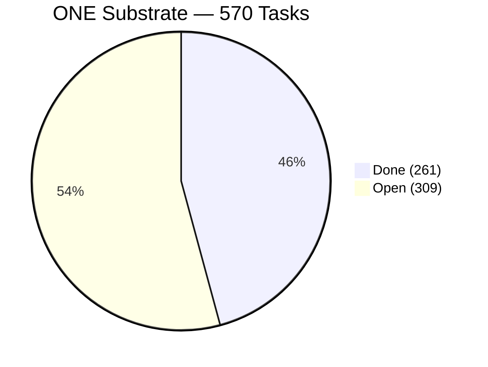
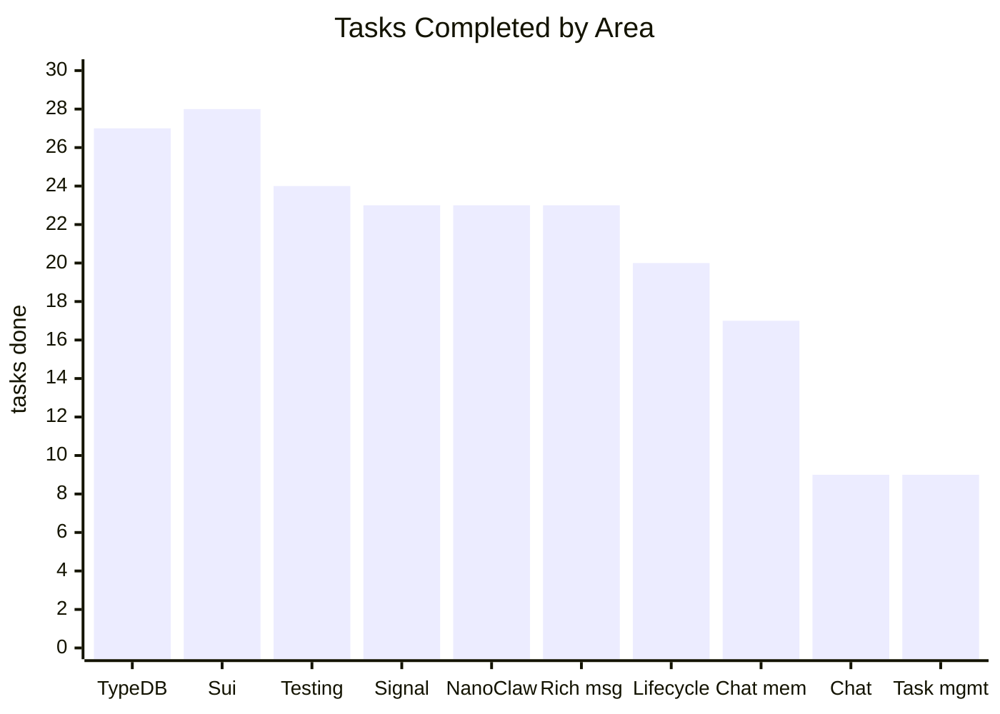
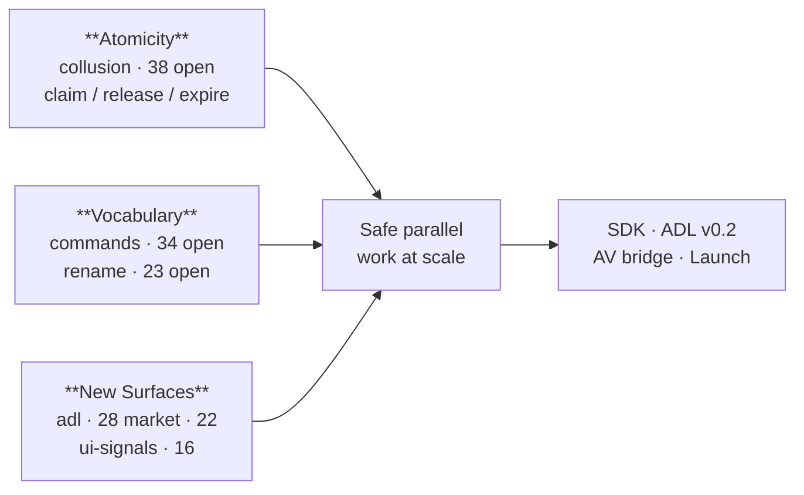
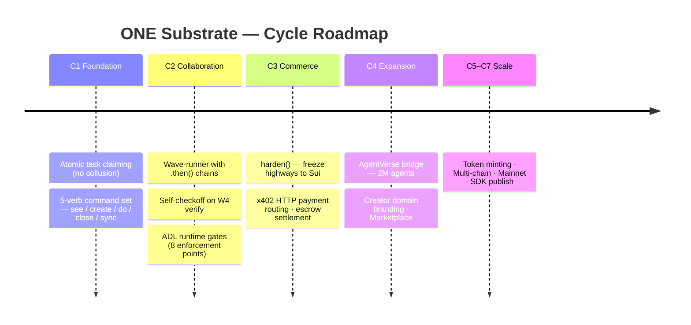

# TODO — ONE Substrate

> Tasks are signals. Waves are loops. The template is a unit.
> **Sync:** `/sync` or `POST /api/tasks/sync` · **Updated:** 2026-04-15


```mermaid
pie title ONE Substrate — 570 Tasks
    "Done (261)" : 261
    "Open (309)" : 309
```

---

## What We've Built


```mermaid
xychart-beta
    title "Tasks Completed by Area"
    x-axis ["TypeDB", "Sui", "Testing", "Signal", "NanoClaw", "Rich msg", "Lifecycle", "Chat mem", "Chat", "Task mgmt"]
    y-axis "tasks done" 0 --> 30
    bar [27, 28, 24, 23, 23, 23, 20, 17, 9, 9]
```

| Area | Done | What shipped |
|------|:----:|-------------|
| **TypeDB brain** | 27 | Context resolution, wave routing, rubric scorer, L5 evolution per-dimension, frontier detection |
| **Sui testnet** | 28 | Phase 1–5: contract deployed, units on-chain, signals, payments, bridge (mirror/absorb/resolve) |
| **Testing** | 24 | persist, api-auth, world-boundary, kek, security-signals, ADL integration suites |
| **Signal shape** | 23 | Three-slot data convention, subscribe verb, tag-filtered WebSocket broadcast |
| **NanoClaw** | 23 | Cycles 1–3.1 GROW — confidence routing, dual-path learning, web browsing tool |
| **Rich messages** | 23 | Thread/reply, payment metadata, D1 columns, image + audio types |
| **Lifecycle** | 20 | register/capable/discover/signal/drop/alarm/fade — 4 outcome types, Sui wallet derivation |
| **Chat memory** | 17 | TypeDB recall, temporal queries, conversation context |
| **Chat** | 9 | Conversation history, group isolation |
| **Task management** | 9 | Context envelope, wave-aware builder, DSL + dict as base context |
| **Deploy pipeline** | 4 | Credentials secured, parallel workers 2.7×, 65 s total |
| **Signal primitives** | 5 | Zero-returns, frozen type, four outcomes |

**Platform:** 670-line deterministic engine · TypeDB brain with 18 skills · Sui testnet live · NanoClaw edge agents deployed · ADL agent passport parser shipped

---

## Where We're Going

### Active Fronts


```mermaid
flowchart LR
    A["**Atomicity**\ncollusion · 38 open\nclaim / release / expire"]
    B["**Vocabulary**\ncommands · 34 open\nrename · 23 open"]
    C["**New Surfaces**\nadl · 28  market · 22\nui-signals · 16"]

    A --> SAFE["Safe parallel\nwork at scale"]
    B --> SAFE
    C --> SAFE
    SAFE --> LAUNCH["SDK · ADL v0.2\nAV bridge · Launch"]
```

### Parallel Track Architecture

**A and B are fully independent.** No shared files, no schema dependencies. Run them simultaneously.

```
GATE (sequential)           TRACK A (TypeDB/API)          TRACK B (docs/CLI)
────────────────            ────────────────────          ──────────────────
W0: bun run verify    ──►  C1: world.tql schema      ║   C1: commands recon × 5
                           C1: claim.ts endpoint      ║   C1: write see.md ✓
                           C1: release.ts endpoint    ║   C1: write create.md ✓
                           C1: expire.ts endpoint     ║   C1: write do.md ✓
                           C1: claim collision test   ║   C1: write close.md ✓
                           C1: release safety test    ║   C1: write sync.md ✓
                           C1: expire recovery test   ║   C1: cleanup 11 old files
                                │                          │
                           C2: filter active tasks    ║   C2: rename W1 recon × 4
                           C2: sync guard             ║   C2: rename W2 decide
                           C2: tick integration       ║   C2: rename W3 edits × 4
                                │                          │
                           C3: harden() → Sui         ║   C3: ADL gates × 8
                           C3: marketplace listing    ║
                                │
                           C4: wave-runner unit
                           C4: loop.ts tests
                           C4: CEO visibility
```

**Security → Stability → Speed** is the order within each track:
- Security: no collusion (C1 atomicity) + ADL gates (C3)
- Stability: tests gate every cycle (W0 + W4)
- Speed: parallel execution within tracks, feedback signals accumulate pheromone

### Roadmap


```mermaid
timeline
    title ONE Substrate — Cycle Roadmap
    C1 Foundation   : Atomic task claiming (no collusion)
                    : 5-verb command set — see / create / do / close / sync
    C2 Collaboration : Wave-runner with .then() chains
                     : Self-checkoff on W4 verify
                     : ADL runtime gates (8 enforcement points)
    C3 Commerce     : harden() — freeze highways to Sui
                    : x402 HTTP payment routing · escrow settlement
    C4 Expansion    : AgentVerse bridge — 2M agents
                    : Creator domain branding · Marketplace
    C5–C7 Scale     : Token minting · Multi-chain · Mainnet · SDK publish
```

---

## Active TODOs

### In Progress

| TODO | Progress | Status |
|------|----------|--------|
| [collusion](TODO-collusion.md) | 16 / 54 done | C2 — filtering + sync guards |
| [commands](TODO-commands.md) | 3 / 37 done | C2 — write 5 command files |
| [SUI](TODO-SUI.md) | 28 / 58 done | GROW — Phase 2 identity + escrow |
| [adl](TODO-adl.md) | 1 / 29 done | WIRE — 8 runtime gates to close |
| [rename](TODO-rename.md) | 1 / 24 done | C1 — W1-W4 queued |
| [claw](TODO-claw.md) | 23 / 46 done | PROVE — Cycles 1–3.1 done; C3.2 verifying |
| [marketplace](TODO-marketplace.md) | 1 / 23 done | WIRE — capability listing + SKU classes |
| [task-management](TODO-task-management.md) | 9 / 26 done | PROVE — wave-runner + self-checkoff |
| [ui-signals](TODO-ui-signals.md) | 0 / 16 done | WIRE — UI clicks as substrate signals |
| [testing](TODO-testing.md) | 24 / 40 done | PROVE — loop.ts, agent-md, nanoclaw router |
| [ONE-strategy](TODO-ONE-strategy.md) | 3 / 14 done | GROW — CEO panel, 7 personas, marketplace |
| [template](TODO-template.md) | 0 / 8 done | WIRE — template as /todo skill |
| [lifecycle](TODO-lifecycle.md) | 20 / 28 done | GROW — harden(), federate(), dissolve() |
| [client-ui](TODO-client-ui.md) | 1 / 9 done | WIRE — UI component work |
| [autonomous-orgs](TODO-autonomous-orgs.md) | 4 / 10 done | GROW — tick orchestration + dashboard |
| [security](TODO-security.md) | 0 / 5 done | WIRE — security hardening |
| [rich-messages](TODO-rich-messages.md) | 23 / 28 done | GROW — payment flow, read receipts |
| [design-system-hardening](TODO-design-system-hardening.md) | 1 / 6 done | PROVE — hardening brand system |
| [design-system](TODO-design-system.md) | 3 / 7 done | PROVE — design system refinements |
| [typedb](TODO-typedb.md) | 27 / 28 done | GROW — rubric calibration remaining |
| [one-big-group](TODO-one-big-group.md) | 0 / 1 done | WIRE — group architecture |

### Ready to Start

| TODO | Tasks | Notes |
|------|------:|-------|
| [copy-toolkit](TODO-copy-toolkit.md) | 36 | ONE CLI + toolkit DX merge into envelopes |
| [world-page](TODO-world-page.md) | spec | World map page design — build spec ready |

### Done

| TODO | Tasks | What closed |
|------|------:|------------|
| [signal-shape](TODO-signal-shape.md) | 23 | Three-slot data, subscribe verb, ws filter |
| [chat-memory](TODO-chat-memory.md) | 17 | TypeDB recall, temporal queries |
| [memory](TODO-memory.md) | 12 | Memory API — reveal / forget / frontier |
| [chat](TODO-chat.md) | 9 | Conversation history, group isolation |
| [signal](TODO-signal.md) | 5 | Zero-returns, frozen type, four outcomes |
| [deploy](TODO-deploy.md) | 4 | Credentials secured, dist/ clean |

---

## Sequence — Security · Stability · Speed

> **Parallel tracks.** Gate is sequential. Everything else fans out.
> Track A (TypeDB/API) and Track B (docs/CLI) share no files — run simultaneously.

### Gate (sequential — do first, both tracks blocked until green)

- [x] ****4f. W0 baseline (before C1)**** [haiku] `gate, baseline, P0` ← [TODO-collusion](TODO-collusion.md)
  exit: `bun run verify` passes; all baseline tests green — gate before any C1 schema edits
  ✓ 780/780 tests, 6.92s, exit 0 — 2026-04-15

### Track A — Atomicity (security · no collusion)

- [x] ****1a. Update world.tql**** [haiku] `schema, foundation, P0` ← [TODO-collusion](TODO-collusion.md)
  exit: `grep "owns owner" src/schema/world.tql` returns true; wave-lock entity defined
  ✓ owner + claimed-at + wave-lock all present — pre-existing
- [x] ****1b. Update world.tql attributes**** [haiku] `schema, foundation, P0` ← [TODO-collusion](TODO-collusion.md)
  exit: `attribute owner, value string` defined; claimed-at timestamp attribute added
  ✓ pre-existing in schema
- [x] ****2a. Create src/pages/api/tasks/[id]/claim.ts**** [sonnet] `endpoint, atomicity, P0` ← [TODO-collusion](TODO-collusion.md)
  exit: `curl POST /api/tasks/{id}/claim` returns 200 with owner; 409 if already claimed
  ✓ atomic TypeQL claim — pre-existing
- [x] ****2b. Write atomic TypeQL query for claim**** [haiku] `typedb, atomicity, P0` ← [TODO-collusion](TODO-collusion.md)
  exit: Query has match `has task-status $s; $s = "open"` → delete + insert active + owner
  ✓ pre-existing in claim.ts
- [x] ****3a. Create src/pages/api/tasks/[id]/release.ts**** [sonnet] `endpoint, ownership, P0` ← [TODO-collusion](TODO-collusion.md)
  exit: `curl POST /api/tasks/{id}/release {sessionId}` returns 200; 403 if wrong owner
  ✓ owner-check + 403 guard — pre-existing
- [x] ****4a. Create src/pages/api/tasks/expire.ts**** [sonnet] `endpoint, recovery, P0` ← [TODO-collusion](TODO-collusion.md)
  exit: `curl GET /api/tasks/expire` returns `{ expired: [...], count: N }`
  ✓ 30-min TTL, bulk release — pre-existing
- [ ] ****4c. Claim collision test**** [sonnet] `test, atomicity, P0` ← [TODO-collusion](TODO-collusion.md)
  exit: Two concurrent claims return 200 + 409; only one gets owner
- [ ] **ADL Lifecycle gate: Retired unit → warn(edge, 0.5), no execution** [haiku] `adl, lifecycle, security, P0` ← [TODO-adl](TODO-adl.md)
  exit: Retired/past-sunset unit signal → warn path, return dissolved; active → normal ask
- [ ] **ADL Bridge: allowed sender → suiMark fires; blocked sender → no Sui call** [haiku] `adl, bridge, security, P0` ← [TODO-adl](TODO-adl.md)
  exit: Bridge reads ADL network permissions; blocked senders fail closed (no Sui call)

### Track B — Vocabulary (stability · commands are the CLI)

> Commands `see/create/do/close/sync` already written ✓. Track B is now: cleanup + rename.

- [x] ****2o. Cleanup — delete 11 old command files**** [haiku] `commands, edit, P0` ← [TODO-commands](TODO-commands.md)
  exit: 11 files deleted (tasks, highways, todo, add-task, extract-tasks, wave, work, next, done, report, grow); 5 remain
  ✓ only see/create/do/close/sync/claw present — already clean
- [ ] **Cycle 1 W1: Recon (parallel Haiku × 4)** [haiku] `docs, wire, recon, P0` ← [TODO-rename](TODO-rename.md)
  exit: 4 reports in. Each reports dead names with line numbers, metaphor flags.
- [ ] **Cycle 1 W2: Decide (Opus)** [sonnet] `docs, wire, decide, P0` ← [TODO-rename](TODO-rename.md)
  exit: Edit specs produced. Replace/Keep/Judgment for each dead name.

### New: Feedback Signal + Outcome Audit (speed · the return path)

- [x] **Wire loop:feedback unit — tags + strength → mark tag paths** [sonnet] `engine, signal, feedback, P0`
  exit: `unit('loop:feedback').on('*', ({tags, strength}) => tags.forEach(t => net.mark(\`tag:${t}\`, strength * 5)))`. Registered in boot.ts.
  ✓ wired in boot.ts — outcome-aware: failure→warn(1), dissolved→warn(0.5), strength≥0.65→mark, else→warn(0.5) — 2026-04-15
  blocks: feedback-routing-live
- [ ] **Outcome audit view: /see events buckets by outcome type** [haiku] `ui, analytics, feedback, P1` ← [TODO-ONE-strategy](TODO-ONE-strategy.md)
  exit: `/see events --since 24h` reports `result=N timeout=M dissolved=K failure=J` per agent. Surfaces which agents need L5 evolution.
  blocks: ceo-outcome-visibility

### Intelligence (after C1 atomicity + C2 vocabulary land)

- [ ] **Build wave-runner unit with .then() chains** [opus] `engine, build, P0` ← [TODO-task-management](TODO-task-management.md)
  exit: unit('wave-runner').on('recon',...).then('recon',→decide).on('decide',...).then('decide',→edit)...
- [ ] **Test loop.ts: tick cycle, all 7 loops, chain depth** [opus] `engine, test, P0` ← [TODO-testing](TODO-testing.md)
  exit: loop.ts test file. Covers: L1 signal, L2 mark/warn, L3 fade interval, L5 evolution trigger, L6 know, L7 frontier detection
- [ ] **Wire CEO visibility: highways (top 10 performers)** [sonnet] `ui, analytics, P0, ceo` ← [TODO-ONE-strategy](TODO-ONE-strategy.md)
  exit: CEO sees top 10 by net strength (reputation = mark - warn). Arithmetic only.

### Commerce (C3 — after intelligence layer stable)

- [ ] **Implement harden(): freeze highway to Sui** [opus] `engine, lifecycle, P0` ← [TODO-lifecycle](TODO-lifecycle.md)
  exit: `persist.know()` writes proven highways to Sui as ProvenCapability objects. Irreversible. Verifiable.
- [ ] **`curl /api/market/list` returns ≥ 5 capabilities with price + strength** [sonnet] `marketplace, api, P0` ← [TODO-marketplace](TODO-marketplace.md)
  exit: Marketplace listing live. Agents' priced skills queryable with pheromone weight shown.

---

## C1: Foundation

- [ ] **Wire loop:feedback unit** — critical=30 + C1=40 + dev=20 + blocks(1)=5 [sonnet] `engine, signal, feedback, P0`
  exit: unit('loop:feedback') registered in boot.ts; marks tag paths on result, warns on failure; scope=private
  blocks: feedback-routing-live
- [ ] **Outcome audit: /see events buckets by outcome type** — high=25 + C1=40 + dev=20 [haiku] `ui, analytics, feedback, P1`
  exit: result/timeout/dissolved/failure counts per-agent for last 24h. Surfaces L5 evolution candidates.
  blocks: ceo-outcome-visibility
- [ ] **Build CEO control panel: hire/fire/commend/flag agents** — critical=30 + C1=40 + ceo=25 + blocks(1)=5 [sonnet] `ui, governance, P0, ceo` ← [ONE-strategy](TODO-ONE-strategy.md)
  exit: CEO can manage AI agents: delegate tasks, view top performers, flag bad actors
  blocks: ceo-control-live
- [ ] **Wire CEO visibility: highways (top 10 performers)** — critical=30 + C1=40 + ceo=25 + blocks(1)=5 [sonnet] `ui, analytics, P0, ceo` ← [ONE-strategy](TODO-ONE-strategy.md)
  exit: CEO sees top 10 by net strength (reputation = mark - warn). Arithmetic only.
  blocks: ceo-control-live
- [ ] **Seed: Insert Phase 1 tasks (marketing, engineering, telegram, dashboard)** — critical=30 + C1=40 + dev=20 + blocks(1)=5 [haiku] `typedb, build, P0, foundation` ← [autonomous-orgs](TODO-autonomous-orgs.md)
  exit: Marketing, engineering, telegram, dashboard tasks seeded in TypeDB
  blocks: c1-tasks-live
- [ ] **Loop: Modify /api/tick to orchestrate tasks** — critical=30 + C1=40 + dev=20 + blocks(1)=5 [sonnet] `api, routing, P0, foundation` ← [autonomous-orgs](TODO-autonomous-orgs.md)
  exit: /api/tick picks highest-priority task, executes signal, marks outcome
  blocks: tick-orchestration
- [ ] **Create 7-persona vocabulary layer: CEO/Dev/Investor/Gamer/Kid/Freelancer/Agent** — high=25 + C1=40 + dev=20 + blocks(1)=5 [sonnet] `foundation, design, P1, governance` ← [ONE-strategy](TODO-ONE-strategy.md)
  exit: Every formula maps to 7 vocabulary skins. Same math, different words.
  blocks: persona-translation
- [ ] ****1a. Update world.tql**** — critical=30 + C1=40 + haiku=5 + blocks(2)=10 [haiku] `schema, foundation, P0` ← [collusion](TODO-collusion.md)
  exit: `grep "owns owner" src/schema/world.tql` returns true; wave-lock entity defined
  blocks: c1-schema-attribute, c2-filter-tasks
- [ ] **Wire TaskCompleted hook for verify gate** — high=25 + C1=40 + dev=20 [sonnet] `infra, build, P1` ← [testing](TODO-testing.md)
  exit: TaskCompleted hook runs bun run verify. Blocks if tests regress. Gates the mark.
- [ ] **Phase 0: Execute file renames** — critical=30 + C1=40 + operator (human)=5 + blocks(1)=5 [haiku] `migration, sequential, P0` ← [rename](TODO-rename.md)
  exit: All Phase 0 renames complete (git mv), commit, no compile errors
  blocks: phase-1-start
- [ ] **Phase 1: Migrate engine files (5 files × parallel)** — critical=30 + C1=40 + sonnet=5 + blocks(1)=5 [opus] `migration, engine, P0` ← [rename](TODO-rename.md)
  exit: All 5 engine files converted. Import paths fixed. tsc passes.
  blocks: phase-2-start
- [ ] **Cycle 1 W1: Recon (parallel Haiku × 4)** — critical=30 + C1=40 + haiku=5 + blocks(1)=5 [haiku] `docs, wire, recon, P0` ← [rename](TODO-rename.md)
  exit: 4 reports in. Each reports dead names with line numbers, metaphor flags.
  blocks: cycle-1-w2
- [ ] **Cycle 1 W2: Decide (Opus)** — critical=30 + C1=40 + opus=5 + blocks(1)=5 [sonnet] `docs, wire, decide, P0` ← [rename](TODO-rename.md)
  exit: Edit specs produced. Replace/Keep/Judgment for each dead name. DSL + names.md loaded.
  blocks: cycle-1-w3
- [ ] **Cycle 1 W3: Edits (parallel Sonnet × 4)** — critical=30 + C1=40 + sonnet=5 + blocks(1)=5 [opus] `docs, wire, edit, P0` ← [rename](TODO-rename.md)
  exit: All 4 files edited. No content loss. Anchors matched or dissolved reported.
  blocks: cycle-1-w4
- [ ] **Cycle 1 W4: Verify (Sonnet × 1)** — critical=30 + C1=40 + sonnet=5 + blocks(1)=5 [sonnet] `docs, wire, verify, P0` ← [rename](TODO-rename.md)
  exit: Zero dead names in prose (except metaphor tables). Rubric >= 0.65. Links resolve.
  blocks: cycle-2-prove-start
- [ ] ****1a. Recon dictionary.md for emit/commands/tick**** — critical=30 + C1=40 + haiku=5 + blocks(1)=5 [haiku] `docs, recon, P0` ← [commands](TODO-commands.md)
  exit: Report lists every mention of `emit`, command names, and The Tick section, with line numbers
  blocks: c1-decide
- [ ] ****1c. Recon routing.md for router vs command vocabulary**** — critical=30 + C1=40 + haiku=5 + blocks(1)=5 [haiku] `docs, recon, P0` ← [commands](TODO-commands.md)
  exit: Report on Formula, Two Routing Modes, any command references, terminology drift
  blocks: c1-decide
- [ ] ****1d. Recon CLAUDE.md Slash Commands block**** — critical=30 + C1=40 + haiku=5 + blocks(1)=5 [haiku] `docs, recon, P0` ← [commands](TODO-commands.md)
  exit: Report current Slash Commands section with exact line ranges + all cross-refs
  blocks: c1-decide
- [ ] ****1g. Edit dictionary.md — send-rename + Command Set section**** — critical=30 + C1=40 + sonnet=5 + blocks(1)=5 [sonnet] `docs, edit, P0` ← [commands](TODO-commands.md)
  exit: Six Verbs uses `send`; new "The Command Set" section lists 5 verbs with router-primitive mapping
  blocks: c1-verify
- [ ] ****1j. Edit CLAUDE.md — replace Slash Commands with 5-verb sheet**** — critical=30 + C1=40 + sonnet=5 + blocks(1)=5 [sonnet] `docs, edit, P0` ← [commands](TODO-commands.md)
  exit: Slash Commands block is the 5-verb cheat sheet; no `/grow`, `/next`, `/report`, `/extract-tasks` references
  blocks: c1-verify
- [ ] ****1b. Update world.tql attributes**** — critical=30 + C1=40 + haiku=5 + blocks(1)=5 [haiku] `schema, foundation, P0` ← [collusion](TODO-collusion.md)
  exit: `grep "attribute owner, value string" src/schema/world.tql` returns true
  blocks: c2-filter-tasks
- [ ] ****2a. Create src/pages/api/tasks/[id]/claim.ts**** — critical=30 + C1=40 + sonnet=5 + blocks(1)=5 [sonnet] `endpoint, atomicity, P0` ← [collusion](TODO-collusion.md)
  exit: `curl POST /api/tasks/{id}/claim` returns 200 with owner; 409 if already claimed
  blocks: c1-claim-test
- [ ] ****2b. Write atomic TypeQL query for claim**** — critical=30 + C1=40 + sonnet=5 + blocks(1)=5 [haiku] `typedb, atomicity, P0` ← [collusion](TODO-collusion.md)
  exit: Query has `match ... has task-status $s; $s = "open"; delete ... insert active + owner`
  blocks: c1-claim-create
- [ ] ****4a. Create src/pages/api/tasks/expire.ts**** — high=25 + C1=40 + sonnet=5 + blocks(2)=10 [sonnet] `endpoint, recovery, P0` ← [collusion](TODO-collusion.md)
  exit: `curl GET /api/tasks/expire` returns `{ expired: [...], count: N }`
  blocks: c1-expire-test, c2-tick-integration
- [ ] ****4c. Claim collision test**** — critical=30 + C1=40 + sonnet=5 + blocks(1)=5 [sonnet] `test, atomicity, P0` ← [collusion](TODO-collusion.md)
  exit: Two concurrent claims return 200 + 409; only one gets owner
  blocks: c1-prove-baseline
- [ ] ****4f. W0 baseline (before C1)**** — critical=30 + C1=40 + haiku=5 + blocks(1)=5 [haiku] `gate, baseline, P0` ← [collusion](TODO-collusion.md)
  exit: `bun run verify` passes; all baseline tests green
  blocks: c1-schema-task
- [ ] **Wire Stop hook for session-end verify** — medium=20 + C1=40 + dev=20 [haiku] `infra, build, P2` ← [testing](TODO-testing.md)
  exit: Stop hook runs verify, reports any regressions introduced during session.
- [ ] ****1e. Recon engine.md rule for emit vs send**** — high=25 + C1=40 + haiku=5 + blocks(1)=5 [haiku] `docs, recon, P1` ← [commands](TODO-commands.md)
  exit: Report every `emit`/`send`/command reference in `.claude/rules/engine.md`
  blocks: c1-decide
- [ ] ****1i. Edit routing.md — router↔command mapping paragraph**** — high=25 + C1=40 + sonnet=5 + blocks(1)=5 [haiku] `docs, edit, P1` ← [commands](TODO-commands.md)
  exit: One paragraph explaining /see↔follow, /do↔select, /close↔mark/warn, /sync↔tick+know
  blocks: c1-verify
- [ ] ****2c. Re-read confirmation pattern (claim verify)**** — high=25 + C1=40 + sonnet=5 + blocks(1)=5 [haiku] `typedb, verification, P0` ← [collusion](TODO-collusion.md)
  exit: Second TypeQL query confirms match or rejects claim
  blocks: c1-claim-test
- [ ] ****3a. Create src/pages/api/tasks/[id]/release.ts**** — high=25 + C1=40 + sonnet=5 + blocks(1)=5 [sonnet] `endpoint, ownership, P0` ← [collusion](TODO-collusion.md)
  exit: `curl POST /api/tasks/{id}/release {sessionId}` returns 200; 403 if wrong owner
  blocks: c1-release-test
- [ ] ****3b. Owner-checked release query**** — high=25 + C1=40 + sonnet=5 + blocks(1)=5 [haiku] `typedb, safety, P0` ← [collusion](TODO-collusion.md)
  exit: TypeQL matches owner before deleting; non-owner gets empty result
  blocks: c1-release-create
- [ ] ****4b. TTL check logic (30 minutes)**** — high=25 + C1=40 + sonnet=5 + blocks(1)=5 [haiku] `ttl, recovery, P0` ← [collusion](TODO-collusion.md)
  exit: `const CLAIM_TTL_MS = 30 * 60 * 1000` defined; tasks older than TTL are released
  blocks: c1-expire-create
- [ ] ****4d. Release safety test**** — high=25 + C1=40 + sonnet=5 + blocks(1)=5 [haiku] `test, safety, P0` ← [collusion](TODO-collusion.md)
  exit: Wrong owner gets 403; correct owner gets 200
  blocks: c1-prove-baseline
- [ ] ****4e. Expire recovery test**** — high=25 + C1=40 + sonnet=5 + blocks(1)=5 [sonnet] `test, recovery, P0` ← [collusion](TODO-collusion.md)
  exit: Task with claimed-at 31 minutes ago is auto-released
  blocks: c1-prove-baseline
- [ ] ****4g. W4 verify (after C1)**** — critical=30 + C1=40 + sonnet=5 [haiku] `gate, verify, P0` ← [collusion](TODO-collusion.md)
  exit: `bun run verify` passes; claim/release/expire tests pass; rubric ≥ 0.65 all dims

---

## C2: Collaboration

- [ ] **Build wave-runner unit with .then() chains** — critical=30 + C2=35 + dev=20 + blocks(2)=10 [opus] `engine, build, P0` ← [task-management](TODO-task-management.md)
  exit: unit('wave-runner').on('recon',...).then('recon',→decide).on('decide',...).then('decide',→edit)...
  blocks: self-checkoff, wave-mark-transitions
- [ ] **Map waves to core.ts sense→select→act→mark** — critical=30 + C2=35 + dev=20 + blocks(1)=5 [sonnet] `engine, build, P0` ← [task-management](TODO-task-management.md)
  exit: W1=sense, W2=select, W3=act, W4=mark. Each wave is a Loop<T> from core.ts.
  blocks: wave-runner-unit
- [ ] **Build context envelope that accumulates across waves** — critical=30 + C2=35 + dev=20 + blocks(1)=5 [sonnet] `engine, build, P0` ← [task-management](TODO-task-management.md)
  exit: Each .then() carries previous output + new context. W4 has full history of all waves.
  blocks: wave-runner-unit
- [ ] **Test loop.ts: tick cycle, all 7 loops, chain depth** — high=25 + C2=35 + dev=20 + blocks(1)=5 [opus] `engine, test, P0` ← [testing](TODO-testing.md)
  exit: loop.ts test file. Covers: L1 signal, L2 mark/warn, L3 fade interval, L5 evolution trigger, L6 know, L7 frontier detection
  blocks: test-wave-lifecycle
- [ ] **Create agent self-improvement loop: rewrite prompts when success-rate < 50%** — high=25 + C2=35 + dev=20 + blocks(1)=5 [opus] `intelligence, learning, P1, foundation` ← [ONE-strategy](TODO-ONE-strategy.md)
  exit: Agent prompt auto-rewrites every 10 min if samples >= 20 AND success < 50%
  blocks: evolution-live
- [ ] **Dashboard: Show task graph + pheromone in real-time** — high=25 + C2=35 + dev=20 + blocks(1)=5 [opus] `ui, reactflow, P1, visualization` ← [autonomous-orgs](TODO-autonomous-orgs.md)
  exit: ReactFlow visualization showing tasks, dependencies, pheromone trails
  blocks: task-board-live
- [ ] **Make /do autonomous loop wave-aware** — high=25 + C2=35 + dev=20 [sonnet] `engine, build, P1` ← [typedb](TODO-typedb.md)
  exit: /do autonomous loop reads wave from task signal, spawns correct model (haiku/sonnet/opus), advances wave on success
- [ ] **Parse wave and context from TODO files** — high=25 + C2=35 + dev=20 [haiku] `engine, build, P1` ← [task-management](TODO-task-management.md)
  exit: task-parse.ts reads wave: and context: fields. Default W3, context from tags.
- [ ] **Route model by wave position** — high=25 + C2=35 + dev=20 [haiku] `engine, build, P1` ← [task-management](TODO-task-management.md)
  exit: W1→haiku, W2→opus, W3→sonnet, W4→sonnet. EFFORT_MODEL fallback.
- [ ] **Make TODO template a /todo skill** — high=25 + C2=35 + dev=20 [haiku] `engine, build, P1` ← [task-management](TODO-task-management.md)
  exit: /todo creates a TODO file from source doc with wave structure, DSL+dict context, schema link
- [ ] **Test task-sync.ts: TypeDB writes, blocks relations** — high=25 + C2=35 + dev=20 [haiku] `engine, test, P1` ← [testing](TODO-testing.md)
  exit: task-sync.ts test file. Covers: insertTask, insertBlocks, markTaskDone. Mocks TypeDB.
- [ ] **Test tag-filtered loop routing: previousTarget → tag join → task selection** — high=25 + C2=35 + dev=20 [sonnet] `engine, test, P1` ← [testing](TODO-testing.md)
  exit: Loop L1b tries tag-filtered query first when previousTarget set. Falls back to global priority. Tag match prefers relevant tasks over highest-priority unrelated ones.
- [ ] **Test subscription via agent markdown: tags in frontmatter → TypeDB → tasksFor** — high=25 + C2=35 + dev=20 [haiku] `engine, test, P1` ← [testing](TODO-testing.md)
  exit: Agent with tags: [engine, build] in markdown → syncAgent writes tags to TypeDB → tasksFor returns matching open tasks
- [ ] **Phase 2: Migrate schema files (8 files × parallel)** — critical=30 + C2=35 + sonnet=5 + blocks(1)=5 [opus] `migration, schema, P0` ← [rename](TODO-rename.md)
  exit: All 8 schema files converted. world.tql compiles. No broken TypeQL.
  blocks: phase-3-start
- [ ] ****2a. Recon /tasks + /highways → /see absorption**** — critical=30 + C2=35 + haiku=5 + blocks(1)=5 [haiku] `commands, recon, P0` ← [commands](TODO-commands.md)
  exit: Report of current steps + noun surface for /see
  blocks: c2-decide
- [ ] ****2b. Recon /todo + /add-task + /extract-tasks → /create absorption**** — critical=30 + C2=35 + haiku=5 + blocks(1)=5 [haiku] `commands, recon, P0` ← [commands](TODO-commands.md)
  exit: Report of creation flows + noun surface for /create
  blocks: c2-decide
- [ ] ****2c. Recon /wave + /work + /next → /do absorption**** — critical=30 + C2=35 + haiku=5 + blocks(1)=5 [haiku] `commands, recon, P0` ← [commands](TODO-commands.md)
  exit: Report of orchestration logic + --once semantics
  blocks: c2-decide
- [ ] ****2d. Recon /done + /report → /close absorption**** — critical=30 + C2=35 + haiku=5 + blocks(1)=5 [haiku] `commands, recon, P0` ← [commands](TODO-commands.md)
  exit: Report of close + session-record flows
  blocks: c2-decide
- [ ] ****2e. Recon /sync + /grow → /sync absorption**** — critical=30 + C2=35 + haiku=5 + blocks(1)=5 [haiku] `commands, recon, P0` ← [commands](TODO-commands.md)
  exit: Report of tick + doc-scan + noun surface for any-markdown
  blocks: c2-decide
- [ ] ****2g. Write .claude/commands/see.md — full noun surface incl. L4-L6 views**** — critical=30 + C2=35 + sonnet=5 + blocks(1)=5 [sonnet] `commands, edit, P0` ← [commands](TODO-commands.md)
  exit: /see handles tasks/highways/frontiers/toxic/paths + hypotheses/evolved/revenue/events nouns; each maps to a TypeDB read or follow() call; loop-coverage table at top
  blocks: c2-verify
- [ ] ****2h. Write .claude/commands/create.md — task/todo/agent/signal**** — critical=30 + C2=35 + sonnet=5 + blocks(1)=5 [sonnet] `commands, edit, P0` ← [commands](TODO-commands.md)
  exit: /create handles task/todo/agent/signal nouns; all emit via send(); signal is the ad-hoc testing verb
  blocks: c2-verify
- [ ] ****2i. Write .claude/commands/do.md — wave / auto / once / autonomous**** — critical=30 + C2=35 + sonnet=5 + blocks(1)=5 [sonnet] `commands, edit, P0` ← [commands](TODO-commands.md)
  exit: /do handles {TODO}/{TODO} --auto/{TODO} --wave N/(empty)/--once modes; maps to select() + wave routing
  blocks: c2-verify
- [ ] ****2j. Write .claude/commands/close.md — Four Outcomes (mark + warn variants)**** — critical=30 + C2=35 + sonnet=5 + blocks(1)=5 [sonnet] `commands, edit, P0` ← [commands](TODO-commands.md)
  exit: /close handles {id}/(empty)/--fail/--dissolved/--timeout; each maps to the Four Outcomes; Rule 1 closed-loop fully covered
  blocks: c2-verify
- [ ] ****2k. Rewrite .claude/commands/sync.md — absorb tick + L3-L7 sub-invocations + pay + any-markdown**** — critical=30 + C2=35 + sonnet=5 + blocks(1)=5 [opus] `commands, edit, P0` ← [commands](TODO-commands.md)
  exit: /sync handles default/tick/fade/evolve/know/frontier/pay/docs/todos/agents/{path} nouns; each nounable loop L3-L7 exposed; L4 pay emits payment signal with content+weight
  blocks: c2-verify
- [ ] ****2m-extra. Four-Outcomes smoke test script**** — critical=30 + C2=35 + sonnet=5 + blocks(1)=5 [sonnet] `commands, test, P0` ← [commands](TODO-commands.md)
  exit: `.claude/commands/` has a tiny smoke doc showing all 4 /close modes emit the correct mark/warn/neutral; verified by inspection or new vitest
  blocks: c2-verify
- [ ] **Test doc-scan.ts: item extraction, verification, gaps→signals** — medium=20 + C2=35 + dev=20 [sonnet] `engine, test, P2` ← [testing](TODO-testing.md)
  exit: doc-scan.ts test file. Covers: extractItems (checkboxes, gaps), inferTags, inferPriority, verify (keyword match), gapsToSignals
- [ ] **Test agent-md.ts: parse, toTypeDB, syncAgent** — medium=20 + C2=35 + dev=20 [sonnet] `engine, test, P2` ← [testing](TODO-testing.md)
  exit: agent-md.ts test file. Covers: parse frontmatter + system prompt, toTypeDB generates valid TQL, skill extraction
- [ ] **Docs: Cross-link dictionary.md + one-ontology.md to task execution** — medium=20 + C2=35 + dev=20 [haiku] `docs, integration, P1, knowledge` ← [autonomous-orgs](TODO-autonomous-orgs.md)
  exit: docs/dictionary.md and docs/one-ontology.md link to task system
- [ ] **Cycle 2 W1: Recon (parallel Haiku × 20)** — high=25 + C2=35 + haiku=5 + blocks(1)=5 [sonnet] `docs, prove, recon, P0` ← [rename](TODO-rename.md)
  exit: 20 reports in. Dead names flagged per file, metaphor exceptions noted.
  blocks: cycle-2-w2
- [ ] **Cycle 2 W2: Decide (Opus)** — high=25 + C2=35 + opus=5 + blocks(1)=5 [opus] `docs, prove, decide, P0` ← [rename](TODO-rename.md)
  exit: Edit specs for ~20 files. Judgment calls for ants.md, game docs, metaphor tables.
  blocks: cycle-2-w3
- [ ] **Cycle 2 W3: Edits (parallel Sonnet × 20)** — high=25 + C2=35 + sonnet=5 + blocks(1)=5 [opus] `docs, prove, edit, P1` ← [rename](TODO-rename.md)
  exit: ~300 total edits applied. No content loss. Anchors matched.
  blocks: cycle-2-w4
- [ ] **Cycle 2 W4: Verify (Sonnet × 1)** — high=25 + C2=35 + sonnet=5 + blocks(1)=5 [sonnet] `docs, prove, verify, P0` ← [rename](TODO-rename.md)
  exit: Zero dead names in high-traffic docs. Tutorial code matches DSL.md. Rubric >= 0.65.
  blocks: cycle-3-grow-start
- [ ] ****2l-extra. Update CLAUDE.md Skills section to the expanded noun grid**** — high=25 + C2=35 + sonnet=5 + blocks(1)=5 [haiku] `docs, edit, P1` ← [commands](TODO-commands.md)
  exit: CLAUDE.md lists 5 verbs with full noun grid; no stale command names
  blocks: c2-verify
- [ ] ****2n-extra. Verify loop-coverage table consistency**** — high=25 + C2=35 + sonnet=5 + blocks(1)=5 [haiku] `docs, verify, P1` ← [commands](TODO-commands.md)
  exit: Loop-coverage table in TODO-commands.md matches table in each command file (cross-doc consistency)
  blocks: c2-verify
- [ ] ****2o. Cleanup — delete 11 old command files**** — high=25 + C2=35 + sonnet=5 + blocks(1)=5 [haiku] `commands, edit, P0` ← [commands](TODO-commands.md)
  exit: 11 files deleted (tasks, highways, todo, add-task, extract-tasks, wave, work, next, done, report, grow); 5 remain (see/create/do/close/sync)
  blocks: c2-verify
- [ ] ****5a. Modify src/pages/api/tasks/index.ts (local store path)**** — high=25 + C2=35 + sonnet=5 + blocks(1)=5 [haiku] `api, filtering, P0` ← [collusion](TODO-collusion.md)
  exit: `filtered = filtered.filter(t => t.status !== 'in_progress')` added
  blocks: c2-filter-test
- [ ] ****5b. Modify src/pages/api/tasks/index.ts (TypeDB path)**** — high=25 + C2=35 + sonnet=5 + blocks(1)=5 [haiku] `api, filtering, typedb, P0` ← [collusion](TODO-collusion.md)
  exit: TypeQL has `not { $t has task-status "active"; };` in match clause
  blocks: c2-filter-test
- [ ] ****6a. Modify src/engine/task-sync.ts**** — high=25 + C2=35 + sonnet=5 + blocks(1)=5 [sonnet] `sync, safety, P0` ← [collusion](TODO-collusion.md)
  exit: `syncTasks()` reads active task IDs before batch; skips them during insert
  blocks: c2-sync-test
- [ ] ****6b. Active ID set pattern**** — high=25 + C2=35 + sonnet=5 + blocks(1)=5 [haiku] `sync, safety, P0` ← [collusion](TODO-collusion.md)
  exit: `const activeIds = new Set(...)` populated from TypeDB match
  blocks: c2-sync-guard
- [ ] ****7a. Modify src/pages/api/tasks/[id]/complete.ts**** — high=25 + C2=35 + sonnet=5 + blocks(1)=5 [haiku] `api, cleanup, P0` ← [collusion](TODO-collusion.md)
  exit: After `task-status = "done"`, fire `delete owner of $t; delete claimed-at of $t`
  blocks: c2-complete-test
- [ ] ****8b. Filter exclusion test**** — high=25 + C2=35 + sonnet=5 + blocks(1)=5 [sonnet] `test, filtering, P0` ← [collusion](TODO-collusion.md)
  exit: Claim a task, GET /api/tasks → task not in list
  blocks: c2-prove-baseline
- [ ] ****8c. Sync guard test**** — high=25 + C2=35 + sonnet=5 + blocks(1)=5 [sonnet] `test, sync, P0` ← [collusion](TODO-collusion.md)
  exit: Sync with active task in TypeDB → active task unchanged
  blocks: c2-prove-baseline
- [ ] ****8d. Owner cleanup test**** — high=25 + C2=35 + sonnet=5 + blocks(1)=5 [haiku] `test, cleanup, P0` ← [collusion](TODO-collusion.md)
  exit: After complete, re-read task → owner field is empty
  blocks: c2-prove-baseline
- [ ] ****8f. W4 verify (after C2)**** — critical=30 + C2=35 + sonnet=5 [haiku] `gate, verify, P0` ← [collusion](TODO-collusion.md)
  exit: All C2 tests pass; no regressions; rubric ≥ 0.65 all dims
- [ ] ****8a. Modify src/pages/api/tick.ts or create dedicated endpoint**** — medium=20 + C2=35 + sonnet=5 + blocks(1)=5 [sonnet] `tick, recovery, P0` ← [collusion](TODO-collusion.md)
  exit: `/api/tick` calls `expire()` or `/api/tick/expire` exists and runs on cycle
  blocks: c2-tick-test
- [ ] ****8e. Tick integration test**** — medium=20 + C2=35 + sonnet=5 + blocks(1)=5 [sonnet] `test, integration, P0` ← [collusion](TODO-collusion.md)
  exit: `/api/tick` calls expire; stale tasks auto-released
  blocks: c2-prove-baseline

---

## C3: Commerce

- [ ] **Self-checkoff: W4 verify pass marks task done** — critical=30 + C3=30 + dev=20 + blocks(2)=10 [sonnet] `engine, build, P0` ← [task-management](TODO-task-management.md)
  exit: selfCheckoff() → markTaskDone + update checkbox + mark path + unblock + know
  blocks: learn-wave-patterns, auto-unblock
- [ ] **Implement harden(): freeze highway to Sui** — critical=30 + C3=30 + dev=20 + blocks(1)=5 [opus] `engine, lifecycle, P0` ← [lifecycle](TODO-lifecycle.md)
  exit: `persist.know()` writes proven highways to Sui as ProvenCapability objects. Irreversible. Verifiable.
  blocks: impl-federate
- [ ] **Calibrate rubric judge against golden examples** — high=25 + C3=30 + dev=20 [haiku] `engine, P1` ← [typedb](TODO-typedb.md)
  exit: Hand-score 10 responses, judge-score same 10. Delta < 0.15 per dim. Lock judge version.
- [ ] **Auto-unblock: emit signals to dependent tasks** — high=25 + C3=30 + dev=20 [haiku] `engine, build, P1` ← [task-management](TODO-task-management.md)
  exit: Task done → query blocks → enqueue signals for newly-unblocked tasks
- [ ] **Cycle gate: know() when all tasks in phase complete** — high=25 + C3=30 + dev=20 [haiku] `engine, typedb, P1` ← [task-management](TODO-task-management.md)
  exit: Phase complete → know() promotes wave patterns to hypotheses
- [ ] **Learn which context+tag combos lead to golden W4 scores** — high=25 + C3=30 + dev=20 [sonnet] `engine, typedb, P1` ← [task-management](TODO-task-management.md)
  exit: Hypothesis records: "engine+P0 tasks with routing.md context → 0.9 avg score"
- [ ] **Update /done to trigger selfCheckoff** — high=25 + C3=30 + dev=20 [haiku] `engine, build, P1` ← [task-management](TODO-task-management.md)
  exit: /done calls selfCheckoff() → marks, updates checkbox, unblocks, emits
- [ ] **Implement federate(): cross-group routing** — high=25 + C3=30 + dev=20 [opus] `engine, lifecycle, P1` ← [lifecycle](TODO-lifecycle.md)
  exit: `federate(otherWorld)` creates bridge. Signals cross group boundaries. Cross-group paths accumulate.
- [ ] **Lifecycle gate: DROP → HIGHWAY requires threshold** — high=25 + C3=30 + dev=20 [haiku] `engine, lifecycle, P1` ← [lifecycle](TODO-lifecycle.md)
  exit: Highway status only inferred when strength ≥ 50 AND traversals ≥ 50. Early edges stay "fresh".
- [ ] **Lifecycle gate: HIGHWAY → HARDEN requires confirmed** — high=25 + C3=30 + dev=20 [sonnet] `engine, lifecycle, P1` ← [lifecycle](TODO-lifecycle.md)
  exit: know() only writes highways. Requires both TypeDB confirmation AND enough data points. Cold-start protection.
- [ ] **API endpoint: POST /api/harden** — high=25 + C3=30 + dev=20 [sonnet] `api, lifecycle, P1` ← [lifecycle](TODO-lifecycle.md)
  exit: Endpoint triggers know() → Sui write. Returns { tx_hash, highways_frozen: N }. Auth required.
- [ ] **ProvenCapability on-chain structure** — high=25 + C3=30 + dev=20 [sonnet] `sui, lifecycle, P1` ← [lifecycle](TODO-lifecycle.md)
  exit: Move struct matches lifecycle.md spec. Fields: agent, task, strength, completions, hardened_at.
- [ ] **Test API endpoints: signal, tick, state, tasks** — high=25 + C3=30 + dev=20 [sonnet] `api, test, P1` ← [testing](TODO-testing.md)
  exit: API test file. Covers: POST /api/signal routes correctly, GET /api/tick returns TickResult, GET /api/state returns world snapshot
- [ ] **Test nanoclaw router: webhook auth, persona selection, message flow** — high=25 + C3=30 + dev=20 [sonnet] `agent, test, P1` ← [testing](TODO-testing.md)
  exit: nanoclaw test file. Covers: Telegram webhook parsing, persona selection order (BOT_PERSONA → group prefix → default), API key auth
- [ ] **Test rubric scorer: score(), markDims(), tagged edges** — high=25 + C3=30 + dev=20 [sonnet] `engine, test, P1` ← [testing](TODO-testing.md)
  exit: rubric.ts test file. Covers: score returns {fit,form,truth,taste,violations}, markDims writes 4 tagged paths, violations bypass scoring
- [ ] **Add CI pipeline: biome + tsc + vitest on every push** — high=25 + C3=30 + dev=20 [haiku] `infra, build, P1` ← [testing](TODO-testing.md)
  exit: GitHub Action runs bun run verify on push/PR. Badge in README.
- [ ] **Test human lifecycle: visit → observe → use → their signals join graph** — high=25 + C3=30 + dev=20 [sonnet] `api, test, P1` ← [testing](TODO-testing.md)
  exit: Integration test. Human signal enters via /api/signal, routes through agents, mark compounds, human sees highway form in /api/state response.
- [ ] **Test lifecycle gates: each stage transition requires its test to pass** — high=25 + C3=30 + dev=20 [sonnet] `engine, test, P1` ← [testing](TODO-testing.md)
  exit: Test that REGISTER requires unit_exists, CAPABLE requires capability relation, HIGHWAY requires strength≥50. Gate function returns pass/fail.
- [ ] **Test learning acceleration: system gets faster over time** — high=25 + C3=30 + dev=20 [sonnet] `engine, test, P1` ← [testing](TODO-testing.md)
  exit: Send 200 signals. Measure: routing time decreases, highway count increases, LLM calls decrease. The flywheel from speed.md verified in code.
- [ ] **Wire Sui on-chain proofs: paths hardened immutable** — high=25 + C3=30 + investor=15 + blocks(1)=5 [opus] `commerce, sui, blockchain, P1, compliance` ← [ONE-strategy](TODO-ONE-strategy.md)
  exit: Strength, resistance, revenue locked on Sui. Auditable. Compliant.
  blocks: blockchain-live
- [ ] **Build marketplace: humans buy/sell services to agents** — high=25 + C3=30 + investor=15 + blocks(1)=5 [opus] `commerce, payments, P1, revenue` ← [ONE-strategy](TODO-ONE-strategy.md)
  exit: Skill pricing, payment routing, escrow settlement on Sui
  blocks: commerce-live
- [ ] **Revenue: Wire x402 payment routing on Sui (C3)** — high=25 + C3=30 + investor=15 + blocks(1)=5 [opus] `commerce, x402, sui, P0, foundation` ← [autonomous-orgs](TODO-autonomous-orgs.md)
  exit: Payments flow from skills to units on Sui blockchain
  blocks: commerce-live
- [ ] **Evolve builder prompt from wave outcomes** — medium=20 + C3=30 + dev=20 [sonnet] `engine, P2` ← [typedb](TODO-typedb.md)
  exit: L5 evolution considers per-wave success rates. Builder:recon vs builder:edit evolve separately.
- [ ] **Detect failing wave patterns as frontiers** — medium=20 + C3=30 + dev=20 [haiku] `engine, P2` ← [task-management](TODO-task-management.md)
  exit: Repeated W3 fails → frontier. W4 retry > 2 → hypothesis "this pattern struggles"
- [ ] **Feed rubric dims into L5 for wave-runner evolution** — medium=20 + C3=30 + dev=20 [sonnet] `engine, typedb, P2` ← [task-management](TODO-task-management.md)
  exit: L5 reads per-dim strength. Low truth → evolve recon. Low form → evolve edit.
- [ ] **Implement dissolve(): graceful exit** — medium=20 + C3=30 + dev=20 [haiku] `engine, lifecycle, P2` ← [lifecycle](TODO-lifecycle.md)
  exit: `world.remove(id)` removes unit. Paths remain and fade naturally. No penalty. Silence.
- [ ] ****3c. Decide sweep-diff spec**** — high=25 + C3=30 + opus=5 + blocks(2)=10 [sonnet] `docs, decide, P1` ← [commands](TODO-commands.md)
  exit: Sweep diff + index refresh spec
  blocks: c3-sweep-todos, c3-refresh-index
- [ ] ****12f. Two-session parallel work test**** — critical=30 + C3=30 + sonnet=5 + blocks(1)=5 [opus] `test, integration, P0` ← [collusion](TODO-collusion.md)
  exit: Two /work sessions simultaneously → each picks different task, both complete successfully
  blocks: c3-grow-baseline
- [ ] **Coverage target: engine/ ≥ 80%, persist/ ≥ 70%** — medium=20 + C3=30 + dev=20 [haiku] `engine, test, P2` ← [testing](TODO-testing.md)
  exit: bun run test:coverage shows ≥80% line coverage for src/engine/*.ts
- [ ] **Phase 3: Migrate types/lib/skins (5 files × parallel)** — high=25 + C3=30 + sonnet=5 + blocks(1)=5 [opus] `migration, types, P1` ← [rename](TODO-rename.md)
  exit: All 5 files converted. tsc --noEmit clean.
  blocks: phase-4-start
- [ ] ****3a. Recon all TODO-*.md for old command refs**** — high=25 + C3=30 + haiku=5 + blocks(1)=5 [haiku] `docs, recon, P1` ← [commands](TODO-commands.md)
  exit: Report: every line in `docs/TODO-*.md` mentioning an old command name
  blocks: c3-decide
- [ ] ****3b. Recon docs/TODO.md + top-level docs for cross-refs**** — high=25 + C3=30 + haiku=5 + blocks(1)=5 [haiku] `docs, recon, P1` ← [commands](TODO-commands.md)
  exit: Report cross-refs in docs/TODO.md and other index docs
  blocks: c3-decide
- [ ] ****3d. Sweep docs/TODO-*.md for old commands**** — high=25 + C3=30 + sonnet=5 + blocks(1)=5 [haiku] `docs, edit, P1` ← [commands](TODO-commands.md)
  exit: Zero active references to old commands in any TODO file
  blocks: c3-verify
- [ ] ****3e. Refresh docs/TODO.md index**** — high=25 + C3=30 + sonnet=5 + blocks(1)=5 [haiku] `docs, edit, P1` ← [commands](TODO-commands.md)
  exit: Active TODOs + Execution sections use 5-verb commands
  blocks: c3-verify
- [ ] ****3f. Verify C3 — sweep clean, green gate**** — critical=30 + C3=30 + sonnet=5 [haiku] `docs, verify, gate, P0` ← [commands](TODO-commands.md)
  exit: zero stale refs; `bun run verify` green; rubric ≥ 0.65
- [ ] ****9a. Create src/pages/api/waves/[docname]/claim.ts**** — high=25 + C3=30 + sonnet=5 + blocks(1)=5 [sonnet] `endpoint, wave-lock, P1` ← [collusion](TODO-collusion.md)
  exit: `curl POST /api/waves/TODO-rename.md/claim` returns 200; 409 if locked
  blocks: c3-wave-test
- [ ] ****9b. Create src/pages/api/waves/[docname]/release.ts**** — high=25 + C3=30 + sonnet=5 + blocks(1)=5 [sonnet] `endpoint, wave-lock, P1` ← [collusion](TODO-collusion.md)
  exit: `curl POST /api/waves/TODO-rename.md/release` releases lock (owner-checked)
  blocks: c3-wave-test
- [ ] ****10a. Modify .claude/commands/do.md (add SESSION_ID generation)**** — high=25 + C3=30 + sonnet=5 + blocks(1)=5 [haiku] `command, session, P0` ← [collusion](TODO-collusion.md)
  exit: `SESSION_ID="claude-$$-$(date +%s)"` added at top
  blocks: c3-work-test
- [ ] ****10b. Add claim step after SELECT**** — high=25 + C3=30 + sonnet=5 + blocks(1)=5 [sonnet] `command, claim, P0` ← [collusion](TODO-collusion.md)
  exit: POST /api/tasks/{id}/claim with SESSION_ID; retry on 409
  blocks: c3-work-test
- [ ] ****10c. Pass SESSION_ID to complete**** — high=25 + C3=30 + sonnet=5 + blocks(1)=5 [haiku] `command, integration, P0` ← [collusion](TODO-collusion.md)
  exit: POST /api/tasks/{id}/complete includes `"from": "$SESSION_ID"`
  blocks: c3-work-test
- [ ] ****11a. Modify .claude/commands/done.md (pass SESSION_ID)**** — high=25 + C3=30 + sonnet=5 + blocks(1)=5 [haiku] `command, release, P0` ← [collusion](TODO-collusion.md)
  exit: POST /api/tasks/{id}/complete includes `"sessionId": "$SESSION_ID"`
  blocks: c3-done-test
- [ ] ****12c. Session ID generation test**** — high=25 + C3=30 + sonnet=5 + blocks(1)=5 [haiku] `test, session, P0` ← [collusion](TODO-collusion.md)
  exit: Two `/work` invocations generate unique SESSION_IDs
  blocks: c3-grow-baseline
- [ ] ****12d. /done release test**** — high=25 + C3=30 + sonnet=5 + blocks(1)=5 [haiku] `test, release, P0` ← [collusion](TODO-collusion.md)
  exit: After `/done`, task owner is cleared; task back to open
  blocks: c3-grow-baseline
- [ ] ****12g. W4 verify (after C3)**** — critical=30 + C3=30 + sonnet=5 [haiku] `gate, verify, P0` ← [collusion](TODO-collusion.md)
  exit: All C3 tests pass; parallel session test succeeds; rubric ≥ 0.65 all dims
- [ ] **Cycle 3 W1: Recon (parallel Haiku × 20)** — medium=20 + C3=30 + haiku=5 + blocks(1)=5 [sonnet] `docs, grow, recon, P1` ← [rename](TODO-rename.md)
  exit: 20 reports in. External system vocabulary (AgentVerse, Hermes) flagged separately.
  blocks: cycle-3-w2
- [ ] **Cycle 3 W2: Decide (Opus)** — medium=20 + C3=30 + opus=5 + blocks(1)=5 [opus] `docs, grow, decide, P1` ← [rename](TODO-rename.md)
  exit: Edit specs for ~20 strategy docs. External vocabulary preserved. Judgment recorded.
  blocks: cycle-3-w3
- [ ] **Cycle 3 W3: Edits (parallel Sonnet × 20)** — medium=20 + C3=30 + sonnet=5 + blocks(1)=5 [opus] `docs, grow, edit, P1` ← [rename](TODO-rename.md)
  exit: ~200 total edits applied. External system vocabulary preserved.
  blocks: cycle-3-w4
- [ ] **Cycle 3 W4: Verify (Sonnet × 1)** — medium=20 + C3=30 + sonnet=5 + blocks(1)=5 [sonnet] `docs, grow, verify, P0` ← [rename](TODO-rename.md)
  exit: Zero dead names in ONE-vocabulary context. External systems intact. Rubric >= 0.65. Final sweep complete.
  blocks: consolidation-complete
- [ ] ****12a. Modify .claude/commands/wave.md (add wave claim)**** — medium=20 + C3=30 + sonnet=5 + blocks(1)=5 [sonnet] `command, wave-lock, P1` ← [collusion](TODO-collusion.md)
  exit: Before wave execution, POST /api/waves/{docname}/claim; abort if 409
  blocks: c3-wave-test
- [ ] ****12b. Release wave lock after completion**** — medium=20 + C3=30 + sonnet=5 + blocks(1)=5 [haiku] `command, wave-lock, P1` ← [collusion](TODO-collusion.md)
  exit: After final wave step, POST /api/waves/{docname}/release
  blocks: c3-wave-test
- [ ] ****12e. Wave-lock exclusivity test**** — medium=20 + C3=30 + sonnet=5 + blocks(1)=5 [sonnet] `test, wave-lock, P1` ← [collusion](TODO-collusion.md)
  exit: Two sessions claim same wave; second gets 409 conflict
  blocks: c3-grow-baseline

---

## C4: Expansion

- [ ] **Scale to 2M+ AgentVerse agents: bridge AgentVerse discovery + ONE routing** — high=25 + C4=25 + dev=20 + blocks(1)=5 [opus] `integration, expansion, P1, network-effects` ← [ONE-strategy](TODO-ONE-strategy.md)
  exit: ONE substrate routes through AgentVerse 2M agents. Discovery automatic.
  blocks: agentverse-live
- [ ] **Wire creator domains: mint branded agents on your domain** — high=25 + C4=25 + investor=15 + blocks(1)=5 [sonnet] `integration, branding, P1, expansion` ← [ONE-strategy](TODO-ONE-strategy.md)
  exit: creator.domain → agents live, branded, routing under your control
  blocks: domains-live
- [ ] **Phase 4: Migrate API endpoints (11 files × parallel)** — high=25 + C4=25 + sonnet=5 + blocks(1)=5 [opus] `migration, api, P1` ← [rename](TODO-rename.md)
  exit: All 11 files converted. API routes typed. tsc clean.
  blocks: phase-5-start
- [ ] ****Cycle 3: GROW** — Learning from wave transitions (in progress)** — medium=20 + C4=25 + agent=5 [sonnet] `` ← [typedb](TODO-typedb.md)
- [ ] ****Cycle 3: GROW** — Out of ONE (Highway, Harden, Federate, Dissolve)** — medium=20 + C4=25 + agent=5 [sonnet] `` ← [lifecycle](TODO-lifecycle.md)
- [ ] ****2.1 Keypair derivation** — `deriveAgentKeypair(uid, seed)` in `src/lib/sui.ts` + tests** — medium=20 + C4=25 + agent=5 [sonnet] `` ← [SUI](TODO-SUI.md)
- [ ] ****2.2 Wire to /api/agents/sync** — returns `{ wallet: 0x... }` on agent creation** — medium=20 + C4=25 + agent=5 [sonnet] `` ← [SUI](TODO-SUI.md)
- [ ] ****2.3 Wallet Adapter UI** — `@mysten/dapp-kit` in browser for manual signing** — medium=20 + C4=25 + agent=5 [sonnet] `` ← [SUI](TODO-SUI.md)
- [ ] ****2.4 Read-only Discovery** — follow() + select() read Sui Path weights, weight pheromone by on-chain strength** — medium=20 + C4=25 + agent=5 [sonnet] `` ← [SUI](TODO-SUI.md)
- [ ] ****2.5 Transaction history** — `/api/agent/{id}/transactions` → Sui Explorer links** — medium=20 + C4=25 + agent=5 [sonnet] `` ← [SUI](TODO-SUI.md)
- [ ] ****2.6 Gas sponsorship** — Protocol pays gas for new agent creation (Phase 3 escrow setup)** — medium=20 + C4=25 + agent=5 [sonnet] `` ← [SUI](TODO-SUI.md)
- [ ] **Sui Wallet Adapter (`@mysten/dapp-kit`) for browser wallet connect** — medium=20 + C4=25 + agent=5 [sonnet] `` ← [SUI](TODO-SUI.md)
- [ ] **Agent identity = keypair (self-sovereign, not platform-derived)** — medium=20 + C4=25 + agent=5 [sonnet] `` ← [SUI](TODO-SUI.md)
- [ ] **Discovery on-chain (`follow()`/`select()` read Sui path weights)** — medium=20 + C4=25 + agent=5 [sonnet] `` ← [SUI](TODO-SUI.md)
- [ ] **Transaction history UI (link to Sui Explorer)** — medium=20 + C4=25 + agent=5 [sonnet] `` ← [SUI](TODO-SUI.md)
- [ ] **Gas sponsorship (Protocol pays gas for new agents)** — medium=20 + C4=25 + agent=5 [sonnet] `` ← [SUI](TODO-SUI.md)
- [ ] **Create escrow on-chain (lock SUI for async tasks)** — medium=20 + C4=25 + agent=5 [sonnet] `` ← [SUI](TODO-SUI.md)
- [ ] **Release on success (payment + mark + fee, atomic)** — medium=20 + C4=25 + agent=5 [sonnet] `` ← [SUI](TODO-SUI.md)
- [ ] **Cancel on timeout (tokens return, path warned)** — medium=20 + C4=25 + agent=5 [sonnet] `` ← [SUI](TODO-SUI.md)
- [ ] **x402 HTTP flow (402 → fund → execute → release)** — medium=20 + C4=25 + agent=5 [sonnet] `` ← [SUI](TODO-SUI.md)
- [ ] **Multi-hop payment chains** — medium=20 + C4=25 + agent=5 [sonnet] `` ← [SUI](TODO-SUI.md)
- [ ] **Multi-currency (USDC, FET)** — medium=20 + C4=25 + agent=5 [sonnet] `` ← [SUI](TODO-SUI.md)
- [ ] **On-chain fade (CF Worker cron)** — medium=20 + C4=25 + agent=5 [sonnet] `` ← [SUI](TODO-SUI.md)
- [ ] **Harden highways (`freeze_object()`, $0.50 fee)** — medium=20 + C4=25 + agent=5 [sonnet] `` ← [SUI](TODO-SUI.md)
- [ ] **Read frozen highways (on-chain badge in UI)** — medium=20 + C4=25 + agent=5 [sonnet] `` ← [SUI](TODO-SUI.md)
- [ ] **Proof of delivery / consumption** — medium=20 + C4=25 + agent=5 [sonnet] `` ← [SUI](TODO-SUI.md)
- [ ] **Colony treasury on-chain** — medium=20 + C4=25 + agent=5 [sonnet] `` ← [SUI](TODO-SUI.md)
- [ ] **Colony splitting** — medium=20 + C4=25 + agent=5 [sonnet] `` ← [SUI](TODO-SUI.md)
- [ ] **Unit dissolve (balance returns to colony)** — medium=20 + C4=25 + agent=5 [sonnet] `` ← [SUI](TODO-SUI.md)
- [ ] **Protocol fee management** — medium=20 + C4=25 + agent=5 [sonnet] `` ← [SUI](TODO-SUI.md)
- [ ] **Federation (cross-group signals)** — medium=20 + C4=25 + agent=5 [sonnet] `` ← [SUI](TODO-SUI.md)
- [ ] **Security audit** — medium=20 + C4=25 + agent=5 [sonnet] `` ← [SUI](TODO-SUI.md)
- [ ] **Mainnet deployment** — medium=20 + C4=25 + agent=5 [sonnet] `` ← [SUI](TODO-SUI.md)
- [ ] **SDK publish (`@one/sdk`)** — medium=20 + C4=25 + agent=5 [sonnet] `` ← [SUI](TODO-SUI.md)
- [ ] **Multi-chain bridge** — medium=20 + C4=25 + agent=5 [sonnet] `` ← [SUI](TODO-SUI.md)

---

## C5: Analytics

- [ ] **Monitoring: Weekly success metrics dashboard** — medium=20 + C5=20 + investor=15 + blocks(1)=5 [sonnet] `analytics, metrics, P2, knowledge` ← [autonomous-orgs](TODO-autonomous-orgs.md)
  exit: Weekly report showing success rates, revenue, top performers, emerging frontiers
  blocks: metrics-live
- [ ] **Phase 5: Migrate components (7 files × parallel)** — high=25 + C5=20 + sonnet=5 + blocks(1)=5 [opus] `migration, components, P1` ← [rename](TODO-rename.md)
  exit: All 7 component files converted. React types clean.
  blocks: phase-6-start
- [ ] **Create kids learning path: learn pheromone by playing** — medium=20 + C5=20 + kid=10 + blocks(1)=5 [sonnet] `ui, education, gamification, P2, learning` ← [ONE-strategy](TODO-ONE-strategy.md)
  exit: Kids see ant colony, set mood (explore/exploit), watch trails form
  blocks: education-live

---

## C6: Products

- [ ] **Build token minting: creators mint their own tokens on Sui** — medium=20 + C6=15 + investor=15 + blocks(1)=5 [opus] `commerce, sui, tokenomics, P2, scale` ← [ONE-strategy](TODO-ONE-strategy.md)
  exit: Creators mint tokens, agents earn them, marketplace trades them
  blocks: tokenomics-live
- [ ] **Build multi-chain bridge: Sui, Ethereum, Solana native routing** — medium=20 + C6=15 + investor=15 + blocks(1)=5 [opus] `integration, blockchain, P2, scale` ← [ONE-strategy](TODO-ONE-strategy.md)
  exit: Routes work across chains. Payments settle on fastest chain. User chooses.
  blocks: multi-chain-live
- [ ] **Phase 6: Migrate Claude config (9 files × parallel)** — high=25 + C6=15 + sonnet=5 + blocks(1)=5 [sonnet] `migration, config, P1` ← [rename](TODO-rename.md)
  exit: All 9 config files converted. CLAUDE.md, rules, commands all updated.
  blocks: phase-7-start

---

## C7: Scale

- [ ] **Phase 7: Migrate docs (59 files × parallel Haiku)** — high=25 + C7=10 + haiku=5 + blocks(2)=10 [opus] `migration, docs, P1` ← [rename](TODO-rename.md)
  exit: All 59 doc files converted. No dead names in prose (except metaphor tables).
  blocks: phase-8-start, cycle-1-wire-start
- [ ] **Migration complete verification** — critical=30 + C7=10 + operator=5 + blocks(1)=5 [haiku] `migration, gate, P0` ← [rename](TODO-rename.md)
  exit: `bun run build` succeeds. Grep verification clean (no old vocab in engine/schema/types/api/components). All tests green.
  blocks: cycle-1-wire-start
- [ ] **Phase 8: Migrate packages/scripts (12 files × parallel)** — medium=20 + C7=10 + sonnet=5 + blocks(1)=5 [opus] `migration, packages, P2` ← [rename](TODO-rename.md)
  exit: All 12 files converted. Build succeeds.
  blocks: phase-9-start
- [ ] **Phase 9: Migrate archive (4 files × parallel, optional)** — low=20 + C7=10 + sonnet=5 + blocks(1)=5 [sonnet] `migration, archive, P3` ← [rename](TODO-rename.md)
  exit: Archive files converted (or skipped if not deploying)
  blocks: cycle-1-wire-start

---

## Done

- [x] **Phase 10: crystallize → harden** `rename, vocabulary, sui, P1` ← [rename](TODO-rename.md)
- [x] **Create resolveContext function** `engine, build, P0` ← [typedb](TODO-typedb.md)
- [x] **Wire contextForSkill into task selection** `engine, build, P0` ← [typedb](TODO-typedb.md)
- [x] **Add inferDocsFromTags mapping** `engine, build, P1` ← [typedb](TODO-typedb.md)
- [x] **Enrich task signal with context envelope** `engine, build, P0` ← [typedb](TODO-typedb.md)
- [x] **Add recall of prior attempts to task signal** `engine, typedb, P1` ← [typedb](TODO-typedb.md)
- [x] **Query blocking context at selection time** `engine, typedb, P1` ← [typedb](TODO-typedb.md)
- [x] **Filter highways relevant to task tags** `engine, P2` ← [typedb](TODO-typedb.md)
- [x] **Add task-wave attribute to world.tql** `typedb, schema, P0` ← [typedb](TODO-typedb.md)
- [x] **Parse wave position from TODO files** `engine, build, P1` ← [typedb](TODO-typedb.md)
- [x] **Route task to model by wave** `engine, build, P0` ← [typedb](TODO-typedb.md)
- [x] **Consume EFFORT_MODEL in loop.ts** `engine, P1` ← [typedb](TODO-typedb.md)
- [x] **Build wave-aware builder unit with .then() chains** `engine, build, P0` ← [typedb](TODO-typedb.md)
- [x] **Add task-context field to world.tql** `typedb, schema, P2` ← [typedb](TODO-typedb.md)
- [x] **Create rubric scorer that emits tagged-edge marks** `engine, build, P0` ← [typedb](TODO-typedb.md)
- [x] **Wire rubric tagged edges into wave builder W4 verify step** `engine, build, P1` ← [typedb](TODO-typedb.md)
- [x] **Mark each wave transition as a path** `engine, build, P0` ← [typedb](TODO-typedb.md)
- [x] **Record context pattern in hypothesis on task completion** `engine, typedb, P1` ← [typedb](TODO-typedb.md)
- [x] **Detect wave-specific frontiers** `engine, P2` ← [typedb](TODO-typedb.md)
- [x] **Auto-hypothesize from wave failure patterns** `engine, typedb, P1` ← [typedb](TODO-typedb.md)
- [x] **Link task completion to skill capability strength** `engine, typedb, P1` ← [typedb](TODO-typedb.md)
- [x] **Surface context quality in /see highways output** `engine, ui, P2` ← [typedb](TODO-typedb.md)
- [x] **Feed rubric tagged-edge strengths into L5 evolution with per-dimension resolution** `engine, typedb, P1` ← [typedb](TODO-typedb.md)
- [x] ****Cycle 1: WIRE** — Context resolution + enriched signals** `` ← [typedb](TODO-typedb.md)
- [x] ****Cycle 2: PROVE** — Wave tracking + model routing** `` ← [typedb](TODO-typedb.md)
- [x] **Add DSL + dictionary as base context in every wave** `engine, build, P0` ← [task-management](TODO-task-management.md)
- [x] ****Cycle 1: WIRE** — Context into tasks** `` ← [task-management](TODO-task-management.md)
- [x] ****Cycle 2: PROVE** — Waves as core loops** `` ← [task-management](TODO-task-management.md)
- [x] ****Cycle 3: GROW** — Self-learning** `` ← [task-management](TODO-task-management.md)
- [x] **Wave 1 — Reconnaissance (10 Haiku, parallel)** `` ← [signal](TODO-signal.md)
- [x] **Wave 2 — Synthesis (Opus, main context)** `` ← [signal](TODO-signal.md)
- [x] **Wave 3 — Edits (Sonnet, parallel)** `` ← [signal](TODO-signal.md)
- [x] **Wave 4 — Verify (Sonnet) — 8/8 checks pass after micro-fix (Three→Five address modes)** `` ← [signal](TODO-signal.md)
- [x] **Mark complete** `` ← [signal](TODO-signal.md)
- [x] ****Critical:** TypeDB credentials in build output → moved to runtime/secrets** `` ← [deploy](TODO-deploy.md)
- [x] ****High:** TQL injection → input validation + escaping added** `` ← [deploy](TODO-deploy.md)
- [x] **Credentials removed from `dist/`** `` ← [deploy](TODO-deploy.md)
- [x] **`docs/SECURE-DEPLOY.md` created** `` ← [deploy](TODO-deploy.md)
- [x] **Implement register(): unit creation with kind and status** `engine, lifecycle, P0` ← [lifecycle](TODO-lifecycle.md)
- [x] **Implement capable(): declare unit capabilities** `engine, lifecycle, P0` ← [lifecycle](TODO-lifecycle.md)
- [x] **Implement discover(): find units by capability** `engine, lifecycle, P0` ← [lifecycle](TODO-lifecycle.md)
- [x] **API endpoint: POST /api/agents/register** `api, lifecycle, P1` ← [lifecycle](TODO-lifecycle.md)
- [x] **API endpoint: GET /api/agents/discover** `api, lifecycle, P1` ← [lifecycle](TODO-lifecycle.md)
- [x] **TypeDB schema: unit status transitions** `schema, lifecycle, P1` ← [lifecycle](TODO-lifecycle.md)
- [x] **Lifecycle gate: REGISTER → CAPABLE requires unit_exists** `engine, lifecycle, P1` ← [lifecycle](TODO-lifecycle.md)
- [x] **Lifecycle gate: CAPABLE → DISCOVER requires has_capability** `engine, lifecycle, P1` ← [lifecycle](TODO-lifecycle.md)
- [x] **Implement signal lifecycle: route → execute → mark/warn** `engine, lifecycle, P0` ← [lifecycle](TODO-lifecycle.md)
- [x] **Implement drop(): mark on success** `engine, lifecycle, P0` ← [lifecycle](TODO-lifecycle.md)
- [x] **Implement alarm(): warn on failure** `engine, lifecycle, P0` ← [lifecycle](TODO-lifecycle.md)
- [x] **Implement fade(): asymmetric decay** `engine, lifecycle, P1` ← [lifecycle](TODO-lifecycle.md)
- [x] **Lifecycle gate: SIGNAL → DROP requires { result }** `engine, lifecycle, P1` ← [lifecycle](TODO-lifecycle.md)
- [x] **Lifecycle gate: SIGNAL → ALARM requires failure** `engine, lifecycle, P1` ← [lifecycle](TODO-lifecycle.md)
- [x] **4 outcome types fully implemented** `engine, lifecycle, P0` ← [lifecycle](TODO-lifecycle.md)
- [x] **Signal logging to TypeDB** `engine, lifecycle, P1` ← [lifecycle](TODO-lifecycle.md)
- [x] **Implement highway detection: strength ≥ 50, traversals ≥ 50** `engine, lifecycle, P0` ← [lifecycle](TODO-lifecycle.md)
- [x] **Sui wallet derivation: UID → keypair** `engine, lifecycle, P1` ← [lifecycle](TODO-lifecycle.md)
- [x] ****Cycle 1: WIRE** — Into ONE (Register, Capable, Discover) — 8/8 tasks closed 2026-04-14** `` ← [lifecycle](TODO-lifecycle.md)
- [x] ****Cycle 2: PROVE** — Through ONE (Signal, Drop, Alarm, Fade) — 8/8 tasks closed 2026-04-14** `` ← [lifecycle](TODO-lifecycle.md)
- [x] ****1a. Install Sui CLI** — `sui 1.61.2-homebrew`** `` ← [SUI](TODO-SUI.md)
- [x] ****1b. Create keypair** — `0x90096b9e11cff8f0127a22be75c67f8188ee503add9b4c7ff98978fd04cc765d`** `` ← [SUI](TODO-SUI.md)
- [x] ****1c. Fund from faucet** — ~1.9 SUI across 26 gas coins** `` ← [SUI](TODO-SUI.md)
- [x] ****1d. Build contract** — Clean build (removed pinned framework dep, auto-resolved)** `` ← [SUI](TODO-SUI.md)
- [x] ****1e. Run Move tests** — 6/6 pass (unit, deposit/withdraw, path, mark/warn, pay, fade, highway/toxic)** `` ← [SUI](TODO-SUI.md)
- [x] ****1f. Publish** — Package `0xa5e6bddae833220f58546ea4d2932a2673208af14a52bb25c4a603492078a09e`, tx `5GNhTrAyoaHP8BEd3JgnrvZRTThSwv7xu5tNsGg3a6Q6`** `` ← [SUI](TODO-SUI.md)
- [x] ****1g. Set env vars** — `SUI_PACKAGE_ID`, `SUI_PROTOCOL_ID`, `SUI_NETWORK=testnet` in `.env`** `` ← [SUI](TODO-SUI.md)
- [x] ****1h. Generate platform seed** — `SUI_SEED` in `.env`** `` ← [SUI](TODO-SUI.md)
- [x] ****1i. Verify** — `sui client object $SUI_PROTOCOL_ID` shows Protocol { treasury: 0, fee_bps: 50 }** `` ← [SUI](TODO-SUI.md)
- [x] ****2a. Create scout on-chain** — Unit `0x6fd45656222db69f81dbf61c70873fd466ebd8b157bf6694f81314e3e0c13af8`, wallet `0xb0e2d65f43a080ba09275cf3f1ce89ed35309b5fca38df6ad7e6100e616f6dba`** `` ← [SUI](TODO-SUI.md)
- [x] ****2b. Verify on-chain** — Unit { name: "scout", unit_type: "agent", activity: 0, balance: 0 }** `` ← [SUI](TODO-SUI.md)
- [x] ****2c. TypeDB ↔ Sui link** — `absorb()` writes `sui-unit-id` on unit; `resolve(uid)` reads it back** `` ← [SUI](TODO-SUI.md)
- [x] ****2d. View on explorer** — `https://suiscan.xyz/testnet/object/0x6fd45656222db69f81dbf61c70873fd466ebd8b157bf6694f81314e3e0c13af8`** `` ← [SUI](TODO-SUI.md)
- [x] ****3a. Create analyst** — Unit `0x952fea2b99904aa8a365939c5ebc8079014b7cef7ac1ab2375b5a10e4ec6c47d`, wallet `0xfab3...8104`** `` ← [SUI](TODO-SUI.md)
- [x] ****3b. Send signal** — Signal `0x8a17...da42`, payload "hello from scout", task "research"** `` ← [SUI](TODO-SUI.md)
- [x] ****3c. Verify Signal object** — Signal owned by analyst address, payload + sender + receiver correct** `` ← [SUI](TODO-SUI.md)
- [x] ****3d. Verify Path created** — Path `0x956c...76da` scout→analyst, strength: 1, type: "interaction"** `` ← [SUI](TODO-SUI.md)
- [x] ****3e. Check events** — UnitCreated, SignalSent, Marked events all emitted** `` ← [SUI](TODO-SUI.md)
- [x] ****4a. Deposit SUI to unit** — 100000 MIST deposited into scout Unit balance** `` ← [SUI](TODO-SUI.md)
- [x] ****4b. Pay via withdraw+transfer+mark** — Scout withdrew 1000 MIST → analyst address, path marked. Note: Move `pay()` needs both `&mut Unit` (co-sign required) — use withdraw+transfer+mark or escrow pattern instead** `` ← [SUI](TODO-SUI.md)
- [x] ****4c. Verify balances** — Scout: 99000 (100000 - 1000). 1000 MIST arrived at analyst address** `` ← [SUI](TODO-SUI.md)
- [x] ****4d. Protocol fee design** — withdraw+mark bypasses fee (by design). Escrow flow (Phase 3) collects fees atomically via `release_escrow()`** `` ← [SUI](TODO-SUI.md)
- [x] ****4e. Verify path strength** — Path strength: 2, hits: 2 (signal mark + payment mark)** `` ← [SUI](TODO-SUI.md)
- [x] ****5a. Bridge module** — `src/engine/bridge.ts`: mirror + absorb + resolve** `` ← [SUI](TODO-SUI.md)
- [x] ****5b. Schema updated** — `sui-unit-id` on unit, `sui-path-id` on path** `` ← [SUI](TODO-SUI.md)
- [x] ****5c. persist.ts wired** — mark/warn/actor auto-mirror to Sui** `` ← [SUI](TODO-SUI.md)
- [x] ****5d. Absorb endpoint** — `POST /api/absorb { cursor? }` → polls Sui events → writes to TypeDB** `` ← [SUI](TODO-SUI.md)
- [x] ****5e. Verify events queryable** — 5 events (2 UnitCreated, 1 SignalSent, 2 Marked) returned by `queryEvents()`** `` ← [SUI](TODO-SUI.md)
- [x] ****1a. Recon dictionary.md for current Seed/Name/Weight/Events sections**** `docs, recon, P0` ← [signal-shape](TODO-signal-shape.md)
- [x] ****1 Recon DSL.md for signal grammar + current examples**** `docs, recon, P0` ← [signal-shape](TODO-signal-shape.md)
- [x] ****1 Recon naming.md for canonical names list**** `docs, recon, P1` ← [signal-shape](TODO-signal-shape.md)
- [x] ****1 Recon one-ontology.md Events dimension**** `docs, recon, P1` ← [signal-shape](TODO-signal-shape.md)
- [x] ****1 Recon engine.md + CLAUDE.md Signal blocks**** `docs, recon, P1` ← [signal-shape](TODO-signal-shape.md)
- [x] ****1 Decide diff specs for all 6 docs (Opus)**** `docs, decide, P0` ← [signal-shape](TODO-signal-shape.md)
- [x] ****1 Edit dictionary.md — add "Three Slots of Data" section**** `docs, edit, P0` ← [signal-shape](TODO-signal-shape.md)
- [x] ****1 Edit DSL.md — canonical examples use {tags, weight, content}**** `docs, edit, P0` ← [signal-shape](TODO-signal-shape.md)
- [x] ****1 Edit naming.md — add tags/weight/content as canonical**** `docs, edit, P1` ← [signal-shape](TODO-signal-shape.md)
- [x] ****1 Edit one-ontology.md — Events data shape**** `docs, edit, P1` ← [signal-shape](TODO-signal-shape.md)
- [x] ****1 Edit engine.md rule — Signal block**** `docs, edit, P1` ← [signal-shape](TODO-signal-shape.md)
- [x] ****1 Edit CLAUDE.md — Core Concepts → Signal**** `docs, edit, P1` ← [signal-shape](TODO-signal-shape.md)
- [x] ****1 Verify C1 — consistency + green gate**** `docs, verify, gate, P0` ← [signal-shape](TODO-signal-shape.md)
- [x] ****2 Recon tasksFor + agent-md tags + ws broadcast + TaskBoard sub**** `engine, recon, P0` ← [signal-shape](TODO-signal-shape.md)
- [x] ****2 Decide subscribe API + persistence + ws filter + endpoint**** `engine, decide, P0` ← [signal-shape](TODO-signal-shape.md)
- [x] ****2 Add subscribe(tags) to Unit/World in world.ts**** `engine, edit, P0` ← [signal-shape](TODO-signal-shape.md)
- [x] ****2 Persist subscriptions in persist.ts**** `engine, typedb, edit, P1` ← [signal-shape](TODO-signal-shape.md)
- [x] ****2 Tag-filtered broadcast in dev-ws-server.ts**** `infra, edit, P1` ← [signal-shape](TODO-signal-shape.md)
- [x] ****2 TaskBoard subscribes with tags on WebSocket connect**** `ui, edit, P1` ← [signal-shape](TODO-signal-shape.md)
- [x] ****2 New /api/subscribe endpoint**** `api, edit, P1` ← [signal-shape](TODO-signal-shape.md)
- [x] ****2 Tests + verify C2 gate**** `engine, test, verify, gate, P0` ← [signal-shape](TODO-signal-shape.md)
- [x] ****Cycle 1: WIRE** — Docs alignment (dictionary, DSL, naming, ontology, rules, CLAUDE.md)** `` ← [signal-shape](TODO-signal-shape.md)
- [x] ****Cycle 2: GROW** — Router tag-read + Subscribe verb (ws filter + endpoint)** `` ← [signal-shape](TODO-signal-shape.md)
- [x] ****Cycle 1: WIRE** — Docs alignment (dictionary, DSL, routing, CLAUDE.md, engine rule)** `` ← [commands](TODO-commands.md)
- [x] ****Cycle 2: PROVE** — 12 files → 5 commands + full L1-L7 noun coverage** `` ← [commands](TODO-commands.md)
- [x] ****Cycle 3: GROW** — Sweep old-command refs across all TODOs + index** `` ← [commands](TODO-commands.md)
- [x] **W0: Baseline — bun run verify passes (255 tests)** `` ← [collusion](TODO-collusion.md)
- [x] **W1: Recon (Haiku) — PLAN-collusion-mitigation analyzed** `` ← [collusion](TODO-collusion.md)
- [x] **W2: Decide (Opus) — 3 ambiguities resolved; 16 diff specs** `` ← [collusion](TODO-collusion.md)
- [x] **W3: Edit (Sonnet) — All diffs applied + type fixes** `` ← [collusion](TODO-collusion.md)
- [x] **W4: Verify (Sonnet) — Schema ✓, endpoints ✓, integration ✓, commands ✓, rubric 0.89 ✓** `` ← [collusion](TODO-collusion.md)
- [x] **W0: Baseline (bun run verify passes)** `` ← [collusion](TODO-collusion.md)
- [x] **W1: Recon (Haiku) — 4 integration test scenarios identified** `` ← [collusion](TODO-collusion.md)
- [x] **W2: Decide (Opus) — 4 test specs created; rubric threshold confirmed** `` ← [collusion](TODO-collusion.md)
- [x] **W3: Edit (Sonnet) — 27 integration tests written (filter-active, guard-sync, clear-owner, expire-tick)** `` ← [collusion](TODO-collusion.md)
- [x] **W4: Verify (Sonnet) — All tests pass; consistency ✓; no regressions; rubric 0.89 ✓** `` ← [collusion](TODO-collusion.md)
- [x] **W0: Baseline (bun run verify clean)** `` ← [collusion](TODO-collusion.md)
- [x] **W1: Recon (Haiku) — 4 multi-session scenarios identified** `` ← [collusion](TODO-collusion.md)
- [x] **W2: Decide (Opus) — 3 test specs for parallel work + wave-locking** `` ← [collusion](TODO-collusion.md)
- [x] **W3: Edit (Sonnet) — 24 multi-session tests created (parallel-sessions 7, wave-lock 7, ownership 10)** `` ← [collusion](TODO-collusion.md)
- [x] **W4: Verify (Sonnet) — All 51 integration tests passing; no regressions; rubric 0.89 ✓** `` ← [collusion](TODO-collusion.md)
- [x] ****Cycle 3 COMPLETE** — Collision avoidance fully implemented and tested** `` ← [collusion](TODO-collusion.md)
- [x] **Fix one.test.ts: bun:test → vitest import** `engine, fix, P0` ← [testing](TODO-testing.md)
- [x] **Triage 85 type errors — fix or suppress with intent** `engine, fix, P0` ← [testing](TODO-testing.md)
- [x] **Fix 21 biome lint issues or configure intentional exceptions** `engine, fix, P1` ← [testing](TODO-testing.md)
- [x] **Establish green baseline: bun run verify passes** `engine, build, P0` ← [testing](TODO-testing.md)
- [x] **Add vitest config for path aliases and coverage** `engine, build, P1` ← [testing](TODO-testing.md)
- [x] **Wire PostToolUse hook for biome check on edit** `infra, build, P1` ← [testing](TODO-testing.md)
- [x] **Wire PostToolUse hook for TODO doc auto-sync** `infra, build, P1` ← [testing](TODO-testing.md)
- [x] **Synchronous dissolve on missing capability in ask()** `engine, speed, accuracy, P0` ← [testing](TODO-testing.md)
- [x] **Kill wall-clock race in expire-tick TTL boundary test** `test, accuracy, P1` ← [testing](TODO-testing.md)
- [x] **Index hygiene: exclude TODO-template.md from scanTodos** `engine, infra, P2` ← [testing](TODO-testing.md)
- [x] **Normalize malformed phase values across TODO files** `docs, infra, P2` ← [testing](TODO-testing.md)
- [x] **Remove duplicate TODO template file** `docs, infra, P3` ← [testing](TODO-testing.md)
- [x] **Test world.ts: unit creation, signal routing, mark/warn/fade** `engine, test, P0` ← [testing](TODO-testing.md)
- [x] **Test persist.ts: TypeDB sync, toxic check, know/recall, subscribe/tasksFor** `engine, test, P0` ← [testing](TODO-testing.md)
- [x] **Test task-parse.ts: priority formula, TODO parsing** `engine, test, P1` ← [testing](TODO-testing.md)
- [x] **Test context.ts: loadContext, contextForSkill, inferDocsFromTags** `engine, test, P1` ← [testing](TODO-testing.md)
- [x] **Test tag subscription: subscribe, tasksFor, overlap ranking** `engine, test, P0` ← [testing](TODO-testing.md)
- [x] **Speed benchmarks as tests: routing <0.005ms, mark <0.001ms** `engine, test, P1` ← [testing](TODO-testing.md)
- [x] **Test wave lifecycle: W0→W1→W2→W3→W4→selfCheckoff** `engine, test, P0` ← [testing](TODO-testing.md)
- [x] **Test self-learning: mark compounds, fade decays, know promotes** `engine, test, P2` ← [testing](TODO-testing.md)
- [x] **Test agent lifecycle: register → signal → highway in N signals** `engine, test, P0` ← [testing](TODO-testing.md)
- [x] ****Cycle 1: WIRE** — Green baseline** `` ← [testing](TODO-testing.md)
- [x] ****Cycle 2: PROVE** — Test the substrate** `` ← [testing](TODO-testing.md)
- [x] ****Cycle 3: GROW** — Test the lifecycle** `` ← [testing](TODO-testing.md)
- [x] **Prove deterministic routing speed: <0.01ms per decision** `foundation, test, P0, engineering` ← [ONE-strategy](TODO-ONE-strategy.md)
- [x] **Implement isToxic() blocking: resistance >= 10 AND resistance > 2× strength** `engineering, security, P0, foundation` ← [ONE-strategy](TODO-ONE-strategy.md)
- [x] **Build markdown agent deployment: write file, push, live in minutes** `agent, integration, P0, deployment` ← [ONE-strategy](TODO-ONE-strategy.md)
- [x] **Schema: Add task, task-dependency, task-execution entities to world.tql** `typedb, schema, P0, foundation` ← [autonomous-orgs](TODO-autonomous-orgs.md)
- [x] **Functions: Write 6 task selection functions (priority, critical-path, bottleneck, etc.)** `typedb, routing, P0, foundation` ← [autonomous-orgs](TODO-autonomous-orgs.md)
- [x] **Agents: Create 8 marketing agents (markdown or HTTP)** `agent, marketing, P0, deployment` ← [autonomous-orgs](TODO-autonomous-orgs.md)
- [x] **Telegram: Wire signals to @onedotbot channel** `agent, telegram, P0, integration` ← [autonomous-orgs](TODO-autonomous-orgs.md)

---

*This file is generated. Edit the TODO-*.md files, not this. Run `/sync-docs` to regenerate.*
