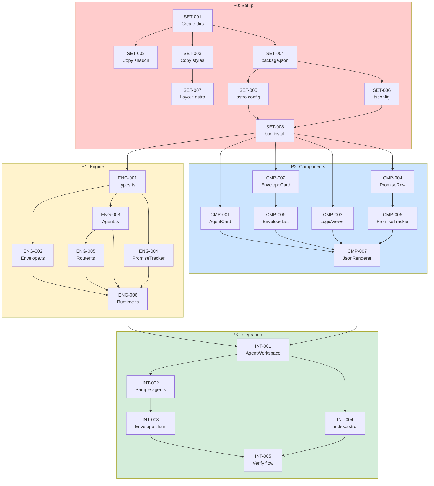

# Envelope System TODO

> **Priority Order:** Setup → Engine → Components → Integration
> **Status:** **COMPLETE** — All tasks done via parallel agent execution.
> **Goal:** Build deterministic agent-to-agent communication system with JSON-driven UI.
> **Updated:** 2026-02-12

---

## Where We Are

```
PROJECT: Envelope-Based Deterministic Agent System
══════════════════════════════════════════════════════════════

Status:           ✅ COMPLETE — Dev server running at localhost:4321
Tech Stack:       Astro + React 19 + shadcn/ui + Tailwind 4 + TypeScript
Architecture:     Runtime Engine (client-side) + JSON-driven UI

IMPLEMENTATION COMPLETE:
  ✅ Runtime Engine — 6 TypeScript files (types, Envelope, Agent, Router, PromiseTracker, Runtime)
  ✅ Frontend UI — 7 React components + JsonRenderer
  ✅ Integration — AgentWorkspace with 3 sample agents and envelope chain
  ✅ Build passes, dev server runs

PARALLEL EXECUTION STATS:
  4 agents launched simultaneously
  Total duration: ~7.5 minutes
  P0 Setup:      72s
  P1 Engine:     218s
  P2 Components: 145s
  P3 Integration: 448s (includes dependency fixes)
══════════════════════════════════════════════════════════════
```

---

## P0: SETUP (Foundation) — COMPLETE

> Project skeleton, configuration, dependencies. Must complete before any code.

| Status | ID | Task | Depends | Parallel |
|:------:|:---|:-----|:--------|:--------:|
| `[x]` | SET-001 | Create project directory and structure | — | ✓ |
| `[x]` | SET-002 | Copy shadcn ui components from ONE/web | SET-001 | ✓ |
| `[x]` | SET-003 | Copy styles (global.css) and lib/utils.ts | SET-001 | ✓ |
| `[x]` | SET-004 | Create package.json with dependencies | SET-001 | ✓ |
| `[x]` | SET-005 | Create astro.config.mjs (React + Tailwind 4) | SET-004 | ✓ |
| `[x]` | SET-006 | Create tsconfig.json with path aliases | SET-004 | ✓ |
| `[x]` | SET-007 | Create base Layout.astro (dark theme) | SET-003 | ✓ |
| `[x]` | SET-008 | Run bun install, verify dev server starts | SET-005, SET-006 | ✗ |

---

## P1: ENGINE (Runtime Core) — COMPLETE

> TypeScript classes that execute the envelope chain. The brain of the system.

| Status | ID | Task | Depends | Parallel |
|:------:|:---|:-----|:--------|:--------:|
| `[x]` | ENG-001 | Create `src/engine/types.ts` — all interfaces (Envelope, Agent, AgentPromise, ActionHandler, UISchema) | SET-008 | ✓ |
| `[x]` | ENG-002 | Create `src/engine/Envelope.ts` — createEnvelope factory function | ENG-001 | ✓ |
| `[x]` | ENG-003 | Create `src/engine/Agent.ts` — DeterministicAgent class with execute(), substitute(), route() | ENG-001 | ✓ |
| `[x]` | ENG-004 | Create `src/engine/PromiseTracker.ts` — tracks promise state (create, resolve, reject) | ENG-001 | ✓ |
| `[x]` | ENG-005 | Create `src/engine/Router.ts` — routes envelopes between agents | ENG-003 | ✓ |
| `[x]` | ENG-006 | Create `src/engine/Runtime.ts` — orchestrator with toUISchema() | ENG-002, ENG-003, ENG-004, ENG-005 | ✗ |

---

## P2: COMPONENTS (UI Layer) — COMPLETE

> React components that render the JSON schema. All driven by data, no hardcoding.

| Status | ID | Task | Depends | Parallel |
|:------:|:---|:-----|:--------|:--------:|
| `[x]` | CMP-001 | Create `AgentCard.tsx` — agent name, status dot, action count | SET-008 | ✓ |
| `[x]` | CMP-002 | Create `EnvelopeCard.tsx` — envelope ID, action, inputs, payload, callback pointer | SET-008 | ✓ |
| `[x]` | CMP-003 | Create `LogicViewer.tsx` — code block with agent execution logic | SET-008 | ✓ |
| `[x]` | CMP-004 | Create `PromiseRow.tsx` — status dot, promise ID, label, status text | SET-008 | ✓ |
| `[x]` | CMP-005 | Create `PromiseTracker.tsx` — list of PromiseRow components | CMP-004 | ✓ |
| `[x]` | CMP-006 | Create `EnvelopeList.tsx` — list of EnvelopeCard components | CMP-002 | ✓ |
| `[x]` | CMP-007 | Create `JsonRenderer.tsx` — recursive component, switch on type, renders correct component | CMP-001, CMP-005, CMP-006, CMP-003 | ✗ |

---

## P3: INTEGRATION (Wire Everything) — COMPLETE

> Connect runtime to UI. Create sample data. Verify full flow.

| Status | ID | Task | Depends | Parallel |
|:------:|:---|:-----|:--------|:--------:|
| `[x]` | INT-001 | Create `AgentWorkspace.tsx` — main page component, initializes Runtime | ENG-006, CMP-007 | ✗ |
| `[x]` | INT-002 | Create 3 sample agents (Data Processor, Router, Validator) with actions | INT-001 | ✓ |
| `[x]` | INT-003 | Create sample envelope chain (processData → routeEnvelope → signPayload) | INT-002 | ✓ |
| `[x]` | INT-004 | Create `src/pages/index.astro` — renders AgentWorkspace client:load | INT-001 | ✓ |
| `[x]` | INT-005 | Verify full flow: runtime executes → JSON schema → UI renders → tabs switch | INT-003, INT-004 | ✗ |

---

## Wave Execution Plan

```
╭──────────────────────────────────────────────────────────────────────────────╮
│                    WAVE EXECUTION PLAN                                       │
├──────────────────────────────────────────────────────────────────────────────┤
│                                                                              │
│   WAVE 0: Setup (Sequential — creates foundation)                            │
│   ├── SET-001: Create project directory                                      │
│   ├── SET-002, SET-003, SET-004: Copy files (parallel after SET-001)         │
│   ├── SET-005, SET-006, SET-007: Create configs (parallel)                   │
│   └── SET-008: Install deps, verify dev server                               │
│                                                                              │
│   WAVE 1: Engine Types + Components Start (4 agents parallel)                │
│   ├── Agent A: ENG-001 (types.ts)                                            │
│   ├── Agent B: CMP-001 (AgentCard)                                           │
│   ├── Agent C: CMP-002 (EnvelopeCard)                                        │
│   └── Agent D: CMP-003 (LogicViewer)                                         │
│                                                                              │
│   WAVE 2: Engine Core + More Components (4 agents parallel)                  │
│   ├── Agent A: ENG-002 (Envelope.ts)                                         │
│   ├── Agent B: ENG-003 (Agent.ts)                                            │
│   ├── Agent C: ENG-004 (PromiseTracker.ts)                                   │
│   └── Agent D: CMP-004 (PromiseRow)                                          │
│                                                                              │
│   WAVE 3: Engine Complete + Component Lists (4 agents parallel)              │
│   ├── Agent A: ENG-005 (Router.ts)                                           │
│   ├── Agent B: CMP-005 (PromiseTracker component)                            │
│   ├── Agent C: CMP-006 (EnvelopeList)                                        │
│   └── Agent D: [wait for deps]                                               │
│                                                                              │
│   WAVE 4: Runtime + JsonRenderer (Sequential — high dependency)              │
│   ├── ENG-006: Runtime.ts (needs all engine files)                           │
│   └── CMP-007: JsonRenderer (needs all components)                           │
│                                                                              │
│   WAVE 5: Integration (Sequential — final wiring)                            │
│   ├── INT-001: AgentWorkspace                                                │
│   ├── INT-002, INT-003, INT-004: Sample data + page (parallel)               │
│   └── INT-005: Full flow verification                                        │
│                                                                              │
╰──────────────────────────────────────────────────────────────────────────────╯
```

---

## Progress Tracking

```
╭──────────────────────────────────────────────────────────────────────────────╮
│                         TASK COMPLETION                                      │
├──────────────────────────────────────────────────────────────────────────────┤
│                                                                              │
│   P0: SETUP       [██████████████████████████████]  8/8   100%  ✅          │
│   P1: ENGINE      [██████████████████████████████]  6/6   100%  ✅          │
│   P2: COMPONENTS  [██████████████████████████████]  7/7   100%  ✅          │
│   P3: INTEGRATION [██████████████████████████████]  5/5   100%  ✅          │
│   ────────────────────────────────────────────────────────────────          │
│   TOTAL           [██████████████████████████████]  26/26 100%  ✅          │
│                                                                              │
│   Completed via 4 parallel agents in ~7.5 minutes                           │
│                                                                              │
╰──────────────────────────────────────────────────────────────────────────────╯
```

---

## Dependency Graph



---

## Design Specs (Quick Reference)

```
DARK THEME
══════════════════════════════════════════════════════════════
Background:       #0a0a0f (near-black)
Borders:          #1e293b (subtle slate)
Text:             white / slate-400 for secondary

STATUS COLORS
══════════════════════════════════════════════════════════════
Ready/Resolved:   #22c55e (green-500)
Pending/Waiting:  #eab308 (amber-500)
Idle:             #64748b (slate-500)
Error/Rejected:   #ef4444 (red-500)

COMPONENT STYLE
══════════════════════════════════════════════════════════════
Envelope cards:   Paper-like, slightly elevated
Logic viewer:     Terminal/code editor feel
Tab bar:          Clean, minimal, active clearly highlighted
Data fields:      Monospace font
```

---

## Critical Requirements

1. **UI is JSON-driven** — Components never hardcode data. Everything flows from `runtime.toUISchema()`
2. **Envelope chain actually executes** — Real agents, real envelopes, real callbacks
3. **Tabs are agents** — Each tab = one agent. Bottom panel shows that agent's state
4. **Two panels = whiteboard boxes** — Top: agent info + promises. Bottom: envelopes + logic + nested
5. **Everything TypeScript** — No `any` except where explicitly shown. Strict mode.
6. **Extensible** — New agent = new DeterministicAgent. New UI type = new case in JsonRenderer.

---

## What NOT to Do

1. **Don't hardcode data in components** — All data comes from JSON schema
2. **Don't skip the engine** — UI means nothing without working runtime
3. **Don't over-engineer** — Build exactly what's in the plan, nothing more
4. **Don't use external state libraries** — useState/useReducer only
5. **Don't add a backend yet** — Client-side only for now

---

## Command Reference

```bash
# Setup commands (from Plan.md)
mkdir -p envelope-system && cd envelope-system
cp ../ONE/web/src/components/ui/*.tsx src/components/ui/
cp ../ONE/web/src/lib/utils.ts src/lib/
bun install
bun dev

# Development
bun dev                    # Start dev server
bun build                  # Build for production
bun preview               # Preview production build
```

---

> "The envelope is the atom of agent communication. Everything else is molecules built from envelopes."
