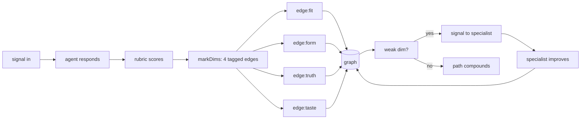

# Rubrics

The POST-check in the deterministic sandwich. Rubrics turn *"did it return"* into *"was it golden"* — and the score feeds `mark()` directly so pheromone learns quality, not just success.

---

## Why rubrics exist

ONE's sandwich wraps every LLM call:

```
PRE:   isToxic(edge)?    → dissolve (no cost)
PRE:   capability exists? → dissolve
LLM:   generate response  (the one probabilistic step)
POST:  result / timeout / dissolved → mark / warn
        │
        └── today: binary. "It returned something → mark(1)."
            missing: "Is it any good?"
```

Rubrics are the missing POST layer. They score the response against fixed dimensions and emit a number in `[0, 1]`. That number becomes the strength argument to `mark()` (or the severity of `warn()`).

```
LLM response ──▶ rubric ──▶ score ──▶ mark(edge, score)
                               │
                               └── pheromone compounds by quality
```

---

## What a golden response is

A golden response is **not** a single right answer. It is a response that clears every must-have dimension in the rubric, regardless of which valid path it took.

```
┌─────────────────────────────────────────────────────────┐
│                                                         │
│   Valid answer space                                    │
│   ┌───────────────────────────────────────────────┐     │
│   │   responses the user would accept             │     │
│   │                                                │     │
│   │    ┌───────────────┐                           │     │
│   │    │  golden zone  │  all must-haves hit       │     │
│   │    │  (many shapes)│  zero must-nots           │     │
│   │    └───────────────┘                           │     │
│   │                                                │     │
│   │   partial: some dims hit → fractional mark    │     │
│   └───────────────────────────────────────────────┘     │
│                                                         │
│   Everything outside → warn()                           │
└─────────────────────────────────────────────────────────┘
```

Multiple answers can all be golden. One missing must-have collapses the whole score.

---

## The four dimensions

Every rubric scores on exactly four dimensions. More is noise.

| Dim | Name      | Question                                | Weight |
| --- | --------- | --------------------------------------- | -----: |
| 1   | **Fit**   | Does it answer the actual ask?          |   0.35 |
| 2   | **Form**  | Is the shape / format / length right?   |   0.20 |
| 3   | **Truth** | Are the facts, numbers, citations real? |   0.30 |
| 4   | **Taste** | Does it sound like the agent's voice?   |   0.15 |
|     |           |                                         |        |

Each dimension is a **tagged edge** — not a separate score. The rubric IS the graph.

```
agent→skill:fit     mark(edge, 0.92)     ← weighted path
agent→skill:form    mark(edge, 0.85)     ← weighted path
agent→skill:truth   mark(edge, 1.00)     ← weighted path
agent→skill:taste   mark(edge, 0.70)     ← weighted path
```

Four `mark()` calls. Four paths. Same `strength - resistance` arithmetic
as routing. `select()` already weights by strength. Tags already exist.
No new system — just tagged edges.

Over N signals, dimensions accumulate independently. `skill:truth` might
reach strength 95 while `skill:taste` sits at 62. L5 evolution reads:
"accurate but sounds wrong — rewrite for voice, not facts."

The composite score is still useful for binary decisions:

```
score = 0.35·fit + 0.20·form + 0.30·truth + 0.15·taste
       │
       ├── >= 0.85  golden        all dims marked strongly
       ├── >= 0.65  good          most dims marked
       ├── >= 0.50  borderline    mixed marks
       └── <  0.50  failed        warn on weak dims
```

---

## Must-haves and must-nots

Each rubric also defines hard gates. Any must-not triggers `warn()` immediately regardless of the weighted score. Any missing must-have caps the relevant dimension at `0.5`.

```yaml
must_have:
  - answers the literal question asked
  - uses the agent's voice/persona
  - cites sources if claims are factual

must_not:
  - hallucinated URLs or stats
  - wrong audience tone (formal vs casual mismatch)
  - empty result wrapped in filler
```

Must-nots are the rubric's toxicity check. They bypass scoring.

---

## Rubric file format

Rubrics live next to agents. One file per skill.

```
agents/donal/
  copywriter.md             ← agent definition
  copywriter.rubric.yml     ← skill-level rubrics
```

```yaml
# agents/donal/copywriter.rubric.yml
skill: copy
version: 1

dimensions:
  fit:
    weight: 0.35
    checks:
      - matches brief topic
      - hits the target audience
      - includes requested CTA
  form:
    weight: 0.20
    checks:
      - within length bounds (30-125 chars for headlines)
      - variant count matches request (3-5)
      - structured as requested (JSON / markdown / plain)
  truth:
    weight: 0.30
    checks:
      - no invented product features
      - claims match the brief's facts
      - numbers are from the brief, not hallucinated
  taste:
    weight: 0.15
    checks:
      - confident, not arrogant
      - brief, not curt
      - warm, not corporate

must_have:
  - at least one variant under 40 chars
  - every headline has a concrete noun
  - CTA present in at least one variant

must_not:
  - false claims ("free forever" when it isn't)
  - competitor bashing
  - stock cliches (robots, handshakes, globes)

golden_examples:
  - brief: "Launch headline for 2-minute deploy"
    response: "Live agent in 2 minutes. No code."
    score: 1.0
    why: "fit: 1, form: 1, truth: 1, taste: 1 — hits every must-have"
```

---

## Scoring it

The scorer is a cheap LLM call (Haiku). It reads the rubric, the input, and
the response — then emits tagged marks directly into the graph.

```typescript
// src/engine/rubric.ts
const DIMS = ['fit', 'form', 'truth', 'taste'] as const

export async function score(
  rubric: Rubric,
  input: unknown,
  response: string
): Promise<RubricScore> {
  const judgment = await complete({
    model: 'anthropic/claude-haiku-4-5',
    system: rubricJudgePrompt(rubric),
    prompt: JSON.stringify({ input, response })
  })
  return parse(judgment)  // { fit, form, truth, taste, violations[] }
}

// Emit tagged edges — rubric dimensions ARE paths
export function markDims(
  net: PersistentWorld,
  edge: string,        // "agent→skill"
  scores: RubricScore,
  rubric: Rubric
) {
  if (scores.violations.length > 0) {
    net.warn(edge, 1)  // must-not hit → full warn, bypass scoring
    return
  }
  for (const dim of DIMS) {
    const taggedEdge = `${edge}:${dim}`   // "agent→skill:fit"
    const s = scores[dim]
    s >= 0.5
      ? net.mark(taggedEdge, s * rubric.dimensions[dim].weight)
      : net.warn(taggedEdge, (1 - s) * rubric.dimensions[dim].weight)
  }
}
```

### Wired into the sandwich

```typescript
// src/engine/persist.ts  (sketch)
const result = await ask(signal)
if (result.result) {
  const r = rubricFor(signal.receiver)
  if (r) {
    const s = await score(r, signal.data, result.result)
    markDims(net, edge, s, r)  // four tagged marks, not one binary
  } else {
    net.mark(edge, 1)  // no rubric → binary fallback
  }
}
```

---

## Per-skill rubric index

Minimum viable set for Donal's stack:

| Skill | File | Golden looks like |
|-------|------|-------------------|
| `copy` | `donal/copywriter.rubric.yml` | 3-5 variants, concrete nouns, CTA, on-voice |
| `fb_ads` | `donal/fb_ads.rubric.yml` | primary text 125 chars, headline 40, hook-angle clear |
| `seo_gbp` | `donal/seo.rubric.yml` | schema valid, EEAT signals, local intent |
| `reports` | `donal/reports.rubric.yml` | numbers cited, lift vs baseline, next-actions |
| `web_dev` | `donal/web_dev.rubric.yml` | compiles, no TODO, a11y basics, mobile-first |
| `analytics` | `donal/analytics.rubric.yml` | source of each number, date range, delta |
| `automation` | `donal/automation.rubric.yml` | idempotent, error path, observable |
| `cro` | `donal/cro.rubric.yml` | hypothesis, metric, sample size, unblocker |
| `ecom` | `donal/ecom.rubric.yml` | SKU accuracy, margin, ops constraints |
| `copywriter:variants` | inherits copy | same plus diversity across hooks |

---

## Results flow up as signals

The result doesn't just get scored — it **travels back up the graph** as a
return signal, marking every path it crosses with tagged weights. The weights
point to different next hops.

```
                          signal DOWN (request)
                          ─────────────────────
    caller ──────────────────────────────────────▶ agent:skill
                          │
                          │  agent responds
                          │
                          signal UP (result + tagged marks)
                          ─────────────────────────────────
    caller ◀──── :fit ────┤  mark(agent→skill:fit, 0.92)
                          │
    reviewer ◀── :truth ──┤  mark(agent→skill:truth, 1.0)
                          │
    voice-coach ◀ :taste ─┤  mark(agent→skill:taste, 0.70)   ← weak, routes here
                          │
    formatter ◀── :form ──┘  mark(agent→skill:form, 0.85)
```

Each tagged weight is simultaneously:
1. **A mark** — pheromone on that dimension's edge
2. **A message** — the score itself is data
3. **A pointer** — weak dims route to the specialist who handles that gap

```typescript
// The return signal carries its own routing
function returnSignal(edge: string, scores: RubricScore): Signal[] {
  const signals: Signal[] = []
  for (const dim of DIMS) {
    const s = scores[dim]
    if (s < 0.65) {
      // Weak dimension → signal the specialist
      signals.push({
        receiver: `${dim}-coach:improve`,    // voice-coach, fact-checker, etc.
        data: { edge, dim, score: s, response: scores.raw }
      })
    }
  }
  return signals  // these get routed through the graph, marking their own paths
}
```

The result is a **fan-out**: one response generates up to four signals,
each marking a different path. The graph specializes by dimension.

---

## How rubrics earn their keep



Three compounding effects:

1. **Routing** — `select()` weights by `strength - resistance`. Tagged edges compound independently — an agent with strong `truth` but weak `taste` still routes for factual work while a better voice agent takes creative work. The graph specializes by dimension.
2. **Evolution** — L5 reads per-dimension strength. `agent→skill:truth` strong but `agent→skill:taste` weak → rewrite prompt for voice, not accuracy. Evolution gets surgical instead of blanket.
3. **Knowledge** — L6 promotes high-strength edges to hypotheses. Tagged edges mean `know()` can report "this agent is golden on fit+truth but fading on form" — hypotheses with dimension resolution.

The graph doesn't just learn *who* is good. It learns *what they're good at*.

---

## What you need to do

```
┌──────────────────────────────────────────────────────────────┐
│                                                              │
│  1.  Draft the rubric types: Rubric, RubricScore, markDims() │
│      src/engine/rubric.ts — tagged edges, not standalone     │
│                                                              │
│  2.  Write the judge prompt (Haiku, JSON-out, deterministic) │
│      Returns { fit, form, truth, taste, violations[] }       │
│                                                              │
│  3.  Wire markDims() into persist.ts after every ask()       │
│      Four tagged marks per response. No rubric → binary.     │
│                                                              │
│  4.  Wire returnSignal() for weak dims → specialist routing  │
│      score < 0.65 → fan-out signal to dim-specific coach     │
│                                                              │
│  5.  Ship 3 rubric YAML files to prove the round-trip        │
│                                                              │
│  6.  Golden examples + calibration (judge vs hand < 0.15)    │
│                                                              │
│  7.  Dashboard: per-skill per-dim strength over 24h          │
│      Shows edge:fit, edge:form, edge:truth, edge:taste       │
│                                                              │
└──────────────────────────────────────────────────────────────┘
```

---

## Anti-patterns

| Don't | Why |
|-------|-----|
| Add a 5th dimension | Noise. 4 dims is the cap. Fold novelty into `taste`. |
| Weight truth below 0.25 | Hallucinations poison the trail faster than style errors. |
| Use GPT-5 as the judge | Cost and latency kill the tick. Haiku is the judge. |
| Write prose rubrics | YAML + checks. The judge must parse, not interpret. |
| Score without golden examples | A rubric without examples drifts. Goldens are the anchor. |
| Skip must-nots | Must-nots are the toxicity check. They are the cheapest signal. |

---

## Calibration loop

```
hand-score 10 responses  ──┐
                            ├──▶ diff  ──▶ if |diff| > 0.15 per dim
judge-score same 10       ──┘               rewrite judge prompt
                                             repeat until < 0.15
                                             lock version in rubric YAML
```

Every rubric has a `version:` field. Bumping it retires old scores from the pheromone average. Calibration is a release event, not a continuous drift.

---

## Relation to existing docs

| Doc | Relation |
|-----|----------|
| `dictionary.md` | `rubric` is a new term — score ∈ [0,1], four dims, must-haves |
| `DSL.md` | `mark(edge, score)` now takes a rubric-weighted float, not a binary |
| `routing.md` | Routing still uses strength-resistance, but strength accrues by quality |
| `donal.md` | Each Fury skill gets a `.rubric.yml` sibling during conversion |
| `metaphors.md` | Ant: "nest quality"; Brain: "reward signal"; Team: "code review" |

---

*Fit. Form. Truth. Taste. Score the response. Feed the trail. Pheromone learns quality.*
