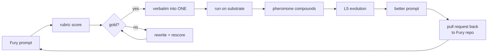

# Ingest

> **Superseded for agent conversion by [`docs/Donal-lifecycle.md`](Donal-lifecycle.md).**
> This doc was written before we had repo access. The lifecycle doc has the
> real conversion plan — no bridge, no rubric judge, no AST walker. Prompts
> lifted verbatim, agents run natively on ONE. This doc remains useful as a
> reference for the **corpus ingestion** portion (knowledge, experiments,
> hypotheses) which hasn't been built yet.

The plan for pulling Donal's Fury stack into ONE. Not a rewrite — an ingestion pipeline that harvests what works, scores what's gold, and wires the rest onto ONE infrastructure.

---

## The goal, in one paragraph

Donal built two things worth keeping: **36 agents that deliver** and **2.2M chars of intel that teaches**. Ingestion's job is to pull both into ONE without touching the Python that's currently earning $14k/mo. Agents become markdown templates wired through the Fury bridge; intel becomes L6 knowledge hypotheses. Rubrics decide which prompts are gold worth copying verbatim, which need rewriting, and which get archived as lessons. After ingestion: ONE runs the routing, learning, billing, and edge delivery; Python keeps running the craft.

---

## Two products, one pipeline

```
                 ┌─────────────────────────────────────┐
                 │        DONAL'S FURY REPO            │
                 │                                     │
                 │  agents/*.py    personas/*.md       │
                 │  specialists/*  experiments.json    │
                 │  corpus/*.md    airtable export     │
                 └──────────────┬──────────────────────┘
                                │
                                ▼
                 ╔══════════════════════════════════════╗
                 ║      scripts/ingest-fury.ts          ║
                 ║  parse · extract · score · emit      ║
                 ╚═══════╦════════════════════╦═════════╝
                         │                    │
          ┌──────────────┘                    └──────────────┐
          ▼                                                   ▼
 ┌────────────────────┐                             ┌────────────────────┐
 │     TEMPLATES      │                             │       CORPUS       │
 │                    │                             │                    │
 │ agents/donal/*.md  │                             │ knowledge/donal/   │
 │ .rubric.yml        │                             │  videos.jsonl      │
 │ src/worlds/donal.ts│                             │  books.jsonl       │
 │                    │                             │  experiments.jsonl │
 │ → syncWorld()      │                             │  → persist.know()  │
 │ → TypeDB units     │                             │  → L6 hypotheses   │
 │ → runtime wires    │                             │                    │
 └────────────────────┘                             └────────────────────┘
     the nervous system                                  the memory
     (runs now, earns now)                           (feeds evolution)
```

Templates and corpus are different products. They land in different folders, they feed different loops, they get different review processes. Do not mix them.

---

## What ingestion extracts

### From each Fury agent (Python file)

| Extract | From | Lands in | How |
|---------|------|----------|-----|
| `name` | filename or class | frontmatter | regex |
| `model` | current default (inherited) | frontmatter | constant override |
| `system prompt` | `SYSTEM` / docstring / constant | markdown body | AST walk |
| `skills` | `run_task` branches | frontmatter | branch analysis |
| `prices` | not set (default) | frontmatter | heuristic by skill class |
| `tags` | file path + docstring keywords | frontmatter | classifier (Haiku) |
| `.then() chain` | call graph to other agents | frontmatter | import-graph |
| `rubric checks` | self-review function | sibling `.rubric.yml` | parse check list |
| `golden examples` | unit tests, fixtures | sibling `.rubric.yml` | test-file scan |

### From personas (28 markdown files)

Already markdown — ingestion wraps each in ONE frontmatter with `tag: persona`, no priced skills, and a `consults` field that marks which domains to surface them in.

### From specialists (10 directories)

Each specialist becomes one markdown template + one `.rubric.yml` scored against the skill it claims to deliver.

### From R&D Batcave (Airtable export)

| Source | → | Destination |
|--------|---|-------------|
| 125 experiments | → | `knowledge/donal/experiments.jsonl` → `persist.know()` hypotheses |
| 20 business ideas | → | `knowledge/donal/ideas.jsonl` → L7 frontier candidates |
| 27 personas | → | `agents/donal/personas/*.md` (ONE template) |
| 83 blockers | → | `knowledge/donal/blockers.jsonl` → toxic-path seeds |

### From corpus (2.2M chars)

| Source | Count | Ingested as |
|--------|------:|-------------|
| Video transcripts | 134 | `knowledge/donal/videos.jsonl` (one record per video) |
| Books (PDF→MD) | 62 | `knowledge/donal/books.jsonl` (one record per chapter) |
| Podcast feeds | 8 | `knowledge/donal/podcasts.jsonl` |
| Courses | 3 | `knowledge/donal/courses.jsonl` |
| SEO ebooks | 8 | `knowledge/donal/ebooks.jsonl` |

Each record: `{ source, title, chunk_id, tokens, tags, content }`. Chunked at ~1k tokens. Tags from classifier. This is not vectorized yet — chunking first, embeddings later when a retrieval pattern actually needs them.

---

## The gold-detector: rubrics at the gate

Every extracted prompt runs through its skill rubric before landing. The rubric score decides the fate.

```
extracted prompt
      │
      ▼
score via Haiku judge   (from docs/rubrics.md)
      │
      ▼
  ┌───┴───────────────────────────────────────────┐
  │                                                │
  ▼                 ▼                ▼             ▼
≥ 0.85         0.65-0.84         0.50-0.64      < 0.50
  │                 │                │             │
  │                 │                │             │
GOLD            REWRITE           REVIEW        ARCHIVE
verbatim copy   LLM rewrite       human read    lesson file
to agents/      pass, rescore     before merge  no wiring
donal/          until ≥0.85
```

Every rubric verdict is logged:

```jsonl
{"agent":"copywriter","skill":"headline","source":"fury/copywriter.py","score":0.91,"verdict":"gold","target":"agents/donal/copywriter.md"}
{"agent":"seo","skill":"gbp","source":"fury/seo.py","score":0.72,"verdict":"rewrite","target":"agents/donal/seo.md","notes":"truth dim weak — over-claims rank lift"}
{"agent":"ecom","skill":"listings","source":"fury/ecom.py","score":0.41,"verdict":"archive","target":"archive/donal/ecom.md","notes":"must_not: hallucinated SKUs"}
```

The ledger is the ingestion report. You read it top-to-bottom and know exactly what's gold, what's salvageable, what's learning.

---

## The ingestion CLI (what we'll build)

```bash
# Dry run — no writes, just the ledger
bun run ingest:fury --source /path/to/fury --dry

# Full ingest with scoring
bun run ingest:fury --source /path/to/fury

# Just corpus, no agents
bun run ingest:fury --source /path/to/fury --only=corpus

# Single agent, verbose
bun run ingest:fury --source /path/to/fury --agent=copywriter -v
```

### Flags

| Flag | Effect |
|------|--------|
| `--source` | Path to Donal's Fury repo |
| `--dry` | Parse + score, no file writes |
| `--only` | `agents` · `corpus` · `experiments` · `personas` |
| `--agent` | Single-agent mode |
| `--rewrite-threshold` | Default 0.85 for gold, 0.65 for rewrite |
| `--judge` | Override judge model (default Haiku) |
| `--out` | Override target paths |
| `-v` | Verbose per-file reasoning |

### What it produces

```
agents/donal/
  README.md                  ← generated index of all ported agents
  copywriter.md
  copywriter.rubric.yml
  seo.md
  seo.rubric.yml
  ... (one per specialist + L1/L2/L3 agent)
  personas/
    feynman.md
    ogilvy.md
    ...

src/worlds/
  donal.ts                   ← WorldSpec referencing all agents above
  elite-movers.ts            ← per-client world (subset of donal agents)
  anc.ts
  ...

knowledge/donal/
  videos.jsonl
  books.jsonl
  experiments.jsonl
  ...

reports/ingest/
  2026-04-11-fury.jsonl      ← the ledger (every verdict)
  2026-04-11-fury.md         ← human-readable summary
```

---

## The Fury bridge (runtime contract)

Templates on their own don't execute yet — the first pass wires them to Donal's Python via HTTP so nothing breaks. A template can graduate to native-LLM execution later, per skill, once its rubric scores stay ≥ 0.85 for two weeks.

```typescript
// src/engine/bridges/fury.ts
const FURY_URL = process.env.FURY_URL ?? 'http://localhost:8000'

export function wireFuryAgent(name: string, net: PersistentWorld) {
  const u = net.add(`donal:${name}`)
  u.on('run', async (data, emit, ctx) => {
    const res = await fetch(`${FURY_URL}/agents/${name}/run`, {
      method: 'POST',
      headers: { 'content-type': 'application/json' },
      body: JSON.stringify({ task: data, from: ctx.from })
    })
    if (!res.ok) return  // dissolve → mild warn via POST check
    return await res.text()
  })
  return u
}
```

Two lines of future work make this rubric-aware:

```typescript
// After the response: score and decide
const r = rubricFor(`donal:${name}`)
if (r) net.markByScore(edge, await score(r, data, result))
```

The graduation criterion: `select()` starts to prefer the ONE-native skill path over the Fury bridge path once the native path's strength exceeds the bridge's. Substrate decides. No human flag-flip.

---

## The learning loop — why this matters

Ingestion is not a one-time import. It's the beginning of a two-way exchange between Donal's craft and ONE's substrate.



The L5 evolution loop already rewrites prompts when success rate drops. When it improves a ported Donal prompt, we push the improvement *back* into the Fury repo as a PR. Donal's Python inherits everything the substrate learns. Two-way flywheel.

---

## What we're looking for (the gold)

```
┌────────────────────────────────────────────────────────────┐
│                                                            │
│  1.  PROMPT PATTERNS that score gold across many briefs    │
│      → lift into agents/donal/ as verbatim templates       │
│                                                            │
│  2.  PERSONA DEFINITIONS (28) that shape taste effectively │
│      → each becomes a tagged unit with no priced skills    │
│                                                            │
│  3.  ORCHESTRATION CHAINS Donal already proved work        │
│      → lift as .then() continuations in markdown           │
│                                                            │
│  4.  EXPERIMENTS (125) with outcome data                   │
│      → pre-seed L6 hypotheses, skip cold-start             │
│                                                            │
│  5.  INGEST PIPELINES (Whisper → MD, PDF → MD)             │
│      → port the pipeline itself as a ONE skill             │
│                                                            │
│  6.  SELF-REVIEW FUNCTIONS per agent                       │
│      → become rubric check lists                           │
│                                                            │
│  7.  CLIENT RETAINER PLAYBOOKS (9 of them)                 │
│      → become per-client WorldSpec files                   │
│                                                            │
└────────────────────────────────────────────────────────────┘
```

What we're *not* ingesting: Airtable as a runtime store (TypeDB replaces it), n8n boards (nanoclaw + .then() replace them), heartbeat.py as glue (L5/L6/L7 replace it), cron (ONE tick replaces it). Those were scaffolding for the Python-only phase. They retire on substrate.

---

## Step-by-step (the first week)

```
Day 1  ──  Scaffold scripts/ingest-fury.ts skeleton
       ──  Write src/engine/bridges/fury.ts
       ──  Hand-port copywriter.md + copywriter.rubric.yml (the baseline)

Day 2  ──  Parser: Fury Python → AgentSpec (no scoring yet)
       ──  Point at Donal's repo, --dry on copywriter, compare to hand-port

Day 3  ──  Rubric judge in src/engine/rubric.ts + judge prompt
       ──  Wire scoring into the ingest CLI

Day 4  ──  Run --dry on all 10 specialists, read the ledger with Donal
       ──  Tune judge prompt until hand vs judge delta < 0.15 per dim

Day 5  ──  Full ingest: specialists + personas → agents/donal/
       ──  syncWorld(donalSpec) → TypeDB
       ──  Wire nanoclaw channel config

Day 6  ──  Corpus ingest: videos + books + experiments → knowledge/donal/
       ──  persist.know() bulk load

Day 7  ──  First retainer on substrate: Elite Movers as WorldSpec
       ──  Send one real task end-to-end through nanoclaw
       ──  Watch pheromone form on the dashboard
```

Week 2: remaining 26 agents + 8 retainers. Week 3: flagship worlds (AI Ranking, Link-building). Week 4: L5 evolution starts rewriting low-scoring prompts, first PR back to Fury repo.

---

## Open questions for Donal

These block day 1. Ask once, then proceed.

1. **Repo path** — is Fury on GitHub or local only? Read access for the ingest CLI?
2. **Default model** — what's the current Python default? (Maps to `model:` in frontmatter.)
3. **Pricing intuitions** — rough `price:` per skill class, or let ONE's L4 auto-tune?
4. **Self-review functions** — naming convention so the parser can find them?
5. **Corpus licenses** — which of the 134 videos / 62 books can be stored as chunks in `knowledge/donal/`?
6. **Retainer mapping** — which agents does each of the 9 clients actually use? (Drives WorldSpec membership.)
7. **PR-back policy** — when L5 improves a prompt, auto-PR to Fury, or queue for Donal's review?

---

## Relation to existing docs

| Doc | Relation |
|-----|----------|
| `donal.md` | The why and the landscape. `ingest.md` is the how. |
| `rubrics.md` | The gold-detector. Every ingested prompt goes through it. |
| `dictionary.md` | `ingest` joins `know`, `recall`, `evolve` as a first-class verb. |
| `DSL.md` | `syncAgent` + `syncWorld` are the ingest sinks. |
| `routing.md` | Ingested paths seed pheromone; L5/L6 take it from there. |

---

*Ingest the muscle. Score the gold. Wire the rest. Learn both ways.*
